# 深入探究大语言模型

[视频](https://www.youtube.com/watch?v=7xTGNNLPyMI) [Andrej 的 Excalidraw 文件](https://drive.google.com/file/d/1EZh5hNDzxMMy05uLhVryk061QYQGTxiN/view) [Eureka Labs Discord](https://discord.com/invite/3zy8kqD9Cp) 笔记作者：[mk2112](https://github.com/mk2112)

---

**目录：**
- [预训练](#预训练)
	- [第一步：下载并预处理互联网数据](#第一步下载并预处理互联网数据)
	- [第二步：分词](#第二步分词)
		- [字节级分词](#字节级分词)
		- [字节对编码](#字节对编码)
	- [第三步：训练大语言模型背后的神经网络](#第三步训练大语言模型背后的神经网络)
		- [神经网络内部结构](#神经网络内部结构)
	- [第四步：推理](#第四步推理)
	- [回顾：大语言模型预训练流水线](#回顾大语言模型预训练流水线)
	- [GPT-2：训练与推理](#gpt-2训练与推理)
	- [基座模型与野外的 LLaMA](#基座模型与野外的-llama)
	- [回顾：产生幻觉的 LLaMA](#回顾产生幻觉的-llama)
- [后训练](#后训练)
	- [监督微调](#监督微调)
		- [幻觉](#幻觉)
			- [缓解策略一：超出范围的示例](#缓解策略一超出范围的示例)
			- [缓解策略二：自诱导搜索](#缓解策略二自诱导搜索)
		- [大语言模型需要 token 来思考](#大语言模型需要-token-来思考)
		- [大语言模型的计数与拼写](#大语言模型的计数与拼写)
		- [强化学习](#强化学习)
			- [DeepSeek-R1](#deepseek-r1)
			- [基于人类反馈的强化学习](#基于人类反馈的强化学习)
- [大语言模型的未来一片光明](#大语言模型的未来一片光明)
- [如何跟上时代？](#如何跟上时代)

---

**大语言模型（LLM）和 ChatGPT 这类工具到底是什么？** **它们如何创造价值？** **在你输入文字的那个文本框背后，究竟发生了什么？**

---

大语言模型（Large Language Model，LLM）是人工智能（AI）系统，通过从训练数据中识别语言模式来处理和生成类人文本。 
让我们以一种*易于理解*的方式，从输入到输出，介绍大语言模型到底是什么。

谈到大语言模型时，你不可避免地会遇到"prompt"这个术语。 
**提示（Prompt）是输入文本，即你作为用户向大语言模型提供的指令或数据。** 提示可以是一个问题、一个陈述（如文本示例、写作格式等），或任何其他基于文本的内容。大语言模型处理这个提示并生成输出，即所谓的*响应*。

在提供提示并阅读大语言模型的响应时，很明显其中蕴含着某种经验认知。大语言模型可能展示出它能够处理和表达：

- **语法**（拼写、句子结构），
- **语义**（含义），以及
- **语用学**（语言的语境和语气运用）。

**但这怎么可能呢？** 
让我们逐步了解大语言模型开发和运行所涉及的一般步骤。 
我们将以 [ChatGPT](https://chatgpt.com/) 这样的聊天大语言模型为例来进行讲解。

---

## 预训练

分析大语言模型对提示的响应时，输出不仅反映了它对提示本身的引用，还反映了它从提示泛化到更广泛语境的能力——这种语境在大语言模型生成响应时是可以被访问的。**大语言模型的设计目标就是通过预训练（Pretraining）从输入泛化到更广泛的理解。**

> [!NOTE]
> **预训练**描述的是将大语言模型暴露于海量文本的过程。通过特定的暴露方法，大语言模型能够从这些文本中学习统计模式。这些模式最终被保留在大语言模型的参数中。令人惊讶的是，它们能够充分捕获文本中的含义和上下文关联。预训练的目标是调整大语言模型的参数，使其对下一个 token（信息单元）的输出概率尽可能频繁地接近训练数据中的实际下一个 token。换句话说，预训练最大化了大语言模型在已学习分布下产生观测到的下一个 token 的可能性（或最小化交叉熵（Cross-Entropy））。

**以上内容听起来可能有很多术语。别担心，我们才刚开始深入了解这些术语的真正含义。**

到目前为止的关键要点应该是：**预训练**是大语言模型开发中的核心目标，而非仅仅是一个预备步骤。要进行*预训练*，我们需要经历一系列特定的步骤。

### 第一步：下载并预处理互联网数据

**如果我们要将大语言模型暴露于海量文本，首先必须获取海量文本。**

如今，整个互联网规模的数据被用作大语言模型预训练的基础。幸运的是，我们不必自己去爬取互联网。HuggingFace 提供了 *FineWeb*，一个经过策划、过滤的互联网文本内容副本：

- 这是 *FineWeb* 数据集：https://huggingface.co/datasets/HuggingFaceFW/fineweb
- 配套的博客文章：https://huggingface.co/spaces/HuggingFaceFW/blogpost-fineweb-v1

><b>:question: 等等。为什么我们需要这么多文本？这不是非常昂贵吗？</b>
>
>预训练被广泛认为是构建强大大语言模型最昂贵的步骤。不过，我们实际上追求的并非单纯的数量。文本的多样性和质量是预训练出知识渊博、能力多样的大语言模型的关键因素，使其能够理解和生成各种语境下的文本。而这种广泛的理解正是我们对聊天大语言模型所期望的。仅从来源和规模来看，我们可以假设 <i>FineWeb</i> 包含了大量多角度、多样化且信息丰富的文本。将大语言模型暴露于这个文本数据集，将使其接触到广泛主题的广泛语言。

><b>:question: 那么，在更多文本上预训练就能改善大语言模型吗？</b>
>
>不完全是。假设我们用一个包含大量措辞不佳、质量低劣或毫无意义的文本（如产品列表、重复相同文本、缺乏主题多样性等）的数据集来预训练大语言模型。由于数据质量低下，大语言模型的能力会很差，泛化能力也不佳。<b>理想的数据集需要在规模、质量、多样性和获取成本之间找到平衡。</b>像 <i>FineWeb</i> 这样的公开、策划的数据集在这四个方面都有很大帮助。

HuggingFace 在确保 *FineWeb* 既是一个*大规模*又是一个*高质量*的数据集方面投入了大量精力。老实说，HuggingFace 并非自行采集文本数据。相反，他们利用了 [CommonCrawl](https://commoncrawl.org/latest-crawl) 的副本作为基础。自 2007 年以来，*CommonCrawl* 背后的组织一直在爬取互联网并记录所遇到网页的快照。这是原始的、未经处理的数据，而且量非常大。HuggingFace 获取这些数据并从中提炼出更高质量的 *FineWeb* 数据集。

**HuggingFace 如何确保从 *CommonCrawl* 中为 *FineWeb* 选取的文本数据是高质量的？**

为确保保留的数据尽可能干净、一致且无噪声，HuggingFace 执行了一系列称为**数据预处理**的步骤。

**HuggingFace 对 CommonCrawl 应用了以下数据预处理步骤，从潜在低质量的原始文本数据中提炼出干净的数据子集 *FineWeb*：**

	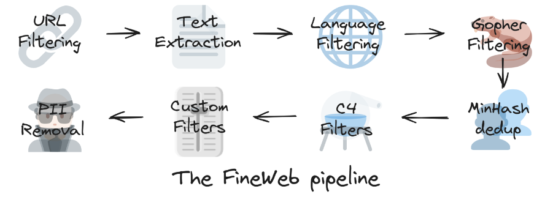
	图片：https://huggingface.co/spaces/HuggingFaceFW/blogpost-fineweb-v1

  

1. **URL 过滤**：
	URL 过滤在文本采集过程之前就移除了被视为低质量或不相关的来源。垃圾邮件、成人内容或非信息性页面等来源被丢弃，确保只保留信誉良好且可能有用的内容。HuggingFace 在此步骤中专门使用了[这个封锁列表](https://dsi.ut-capitole.fr/blacklists/)。
2. **文本提取**：
    URL 过滤完成后，原始的爬取网页内容（包含文本，但也有用于显示网页的底层 HTML 代码、链接等）被处理以丢弃不必要的部分并提取干净、可读的文本。这涉及基于规则地移除 HTML 标签、脚本和其他非文本元素，同时保留主要内容本身。
3. **语言过滤**：
    提取的文本现在经过语言过滤，以确保语料库在语言上是一致的。非目标语言被过滤掉，只保留所需语言的文本。对于 *FineWeb*，HuggingFace 应用 [FastText 语言分类器](https://fasttext.cc/docs/en/language-identification.html)仅保留英文文本。该分类器不仅提供语言判定，还提供其分类的置信度。如果英语的置信度评分 $\geq 0.65$，HuggingFace 就保留该文本以进行进一步处理。
4. **Gopher 过滤**：
    Gopher 过滤最初在 [Google DeepMind 的 Gopher](https://deepsense.ai/wp-content/uploads/2023/03/2112.11446.pdf) 模型中使用，用于移除低质量或样板文本。此步骤使用预定义规则甚至机器学习模型来识别和消除重复的、非信息性的或模板化的内容（如导航菜单、免责声明、产品列表），确保剩余数据集包含有意义且多样化的文本。
5. **MinHash 去重**：
    为避免内容冗余，MinHash 去重通过比较为文本示例生成的哈希值来识别近似重复的文档，移除那些具有另一个相同或近乎相同哈希值的示例。这旨在确保内容多样性，同时避免对相同、高度相似或频繁遇到的文本的过度表示。
6. **C4 过滤器**：
    去重后的数据集现在经过受 [C4 数据集](https://huggingface.co/datasets/allenai/c4)启发的过滤器。这些过滤器帮助识别和移除例如过度标点或非自然语言的行。
7. **自定义过滤器**：
    HuggingFace 现在应用额外的自定义过滤器来解决此阶段数据集中可能遇到的特定需求或偏差。这可能包括领域特定的排除、冒犯性内容的移除或其他定制标准。
8. **个人信息移除**：
    完成 *FineWeb* 的数据预处理后，个人可识别信息（PII）被移除，以确保隐私和遵守数据保护法规。这需要检测和编辑敏感信息，如姓名、地址、电话号码和电子邮件地址。

><b>:question: 等等。仅在英文文本数据集上预训练对我们的大语言模型意味着什么？</b>
>
>大语言模型将擅长处理和回应英文文本。它将能够很好地理解和生成英文文本。但关键的是，它将无法对其他语言做到同样的事情。 不过请注意，虽然 <i>FineWeb</i> 源自英文文本来源，但一个新的、语言更广泛的 <a target="_blank" href="https://huggingface.co/datasets/HuggingFaceFW/fineweb-2">FineWeb 2</a> 已经发布，允许通过暴露于多种语言来预训练模型。

在将原始 CommonCrawl 数据通过预处理流水线后，HuggingFace 获得了 *FineWeb* 数据基底。但这个提炼后的数据集实际上是什么样子？幸运的是，HuggingFace 在他们的[数据集预览](https://huggingface.co/datasets/HuggingFaceFW/fineweb)中向我们展示了：

	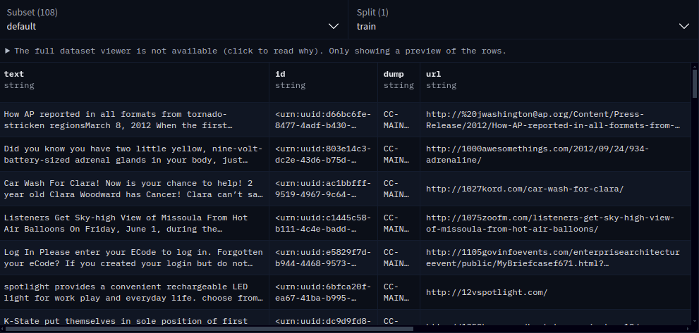

**我们如何理解这些？** 这是一个表格的摘录。从根本上说，**表格的每一行是 *FineWeb* 数据集中的一个独立条目。** 每一行，例如，包含 `text` 列中的一个条目。这是 *CommonCrawl* 从互联网的某个角落检索到的文本，并经过了 HuggingFace 的*数据预处理*。

不过，不仅仅是这个 `text` 列。 *FineWeb* 数据集为每个爬取的网站/文本块包含以下列：

1. `text`：从网页中提取的实际文本内容。
2. `id`：数据集中每个条目的唯一标识符。
3. `dump`：表示此文本提取自哪个特定的 Common Crawl 快照。
4. `url`：原始来源网页的网址。
5. `date`：网页被捕获时的时间戳。
6. `file_path`：文件在数据集存储系统中的位置。
7. `language`：检测到的文本内容语言。
8. `language_score`：语言检测的置信度评分，范围从 $0.65$ 到 $1.00$。
9. `token_count`：文本内容中的 token 数量。我们稍后会讨论这个。

**额外的列为每个数据集条目提供了元数据和上下文。** HuggingFace 提供的 *FineWeb* 数据集不仅仅是文本片段的集合，而是一个结构化、有组织的资源。

**好了，我们刚刚通过 FineWeb 获取了大量高质量文本数据。接下来呢？**

---

### 第二步：分词

*第一步*提出的要求是，如果我们把大语言模型暴露于 *FineWeb* 这个庞大的高质量、信息丰富的文本语料库，大语言模型可能能够内化和建模文本模式以及数据中不同短语之间的细微差别。由此，我们希望推导出一种关于语言如何表达连贯含义和信息的基本的、通用的、概念性的理解。 **那将会很棒。**

*然而*，"将大语言模型暴露于文本数据"并非听起来那么容易。

**标准的大语言模型是一个数学模型。它期望输入是某种有限可处理符号集的一维序列。** 你可能会说文本——一串字符——已经是这样的一维序列了。但我们无法真正用字符进行数学运算。**我们需要某种有用的文本数字表示。** 而且，文本应该被解释为字符序列、单词序列还是音节序列？**什么级别的抽象最合适？** 这正是**分词（Tokenization）**发挥作用的地方。

**分词将文本转换为数字 token，** 使语言模型（Language Model）能够通过数字处理来理解和处理文本。**token 是文本中一个独立含义单元的表示。** 这可以是单词、短语、音节和/或字符。**请记住，标准的大语言模型是数学模型，因此大语言模型从不直接操作原始文本。** 相反，它们分析 token 序列以学习这些 token 之间的统计关系。这个训练过程使大语言模型能够预测后续 token 的可能性，从根本上促进文本生成和理解等下游任务。

> [!NOTE]
>我们需要找到某种**数字表示**，它对于构成文本的所有片段来说，理想情况下是尽可能独特、有表现力且简洁的。将文本转移到这种表示的过程称为**分词**。给定文本的高质量数字表示越简洁，我们最终能用大语言模型处理的文本序列就越长。使用简洁的表示，我们可以将更多分词后的文本同时放入内存中，从而一次性处理更多内容，这反过来有助于扩展大语言模型的上下文视野、理解能力和整体性能。

以上内容包含几个关键见解。**大语言模型并不直接处理用户提供的提示，而是处理一个 token 的上下文窗口。上下文窗口是大语言模型在形成输出时可以同时考虑的 token 序列。上下文窗口的大小是有限的。用户提供的提示可能会被分词并放置在这个上下文窗口中。** 上下文窗口越长，大语言模型在形成输出时可以考虑的 token 就越多。大语言模型可能一开始只用初始用户提示填充上下文窗口，但随后继续用*那个*提示、*它们自己的输出*和用户提供的*下一个提示*，像一个单一的、堆叠的内存一样填满上下文窗口。通过在上下文窗口中按时间顺序保留这些信息，大语言模型在一定程度上可以记住聊天历史并在后续输出中相应地行动。

	

**但现在我们如何有意义地做到这一点？我们如何有效地对文本进行分词？**

就像计算机显示和处理的其他一切一样，**在最低级别的抽象上，文本只是二进制代码。** 我们可以将文本翻译成其二进制表示，那将是*一维的、数字的、唯一的*表示。但它会*极其冗长/庞大*且低效。我们需要大量比特来表示单个字符（例如，使用 Unicode 编码，单个字符可能需要多达 $32$ 个比特）。这自然会限制我们能在计算机提供的固定内存量中一次处理的文本量。换句话说，**Unicode 编码会限制上下文窗口大小，即我们能参考的生成文本量。** 我们会降低大语言模型记忆和引用过去提示和输出的能力。**如果我们使用二进制表示作为抽象级别，我们的大语言模型将不必要地受到损害。**

我们将要深入探讨一种应用于*分词*的具体技术。在进入之前，我想解释一下**token**实际上是什么。 
到目前为止，我们知道 **token 是单个含义单元的表示。** 这本身没有说太多，但很重要。*token* 可以是单个字符、单词、音节甚至某些子词，即文本的某些块。**分词过程不仅是将文本转移到其分词后的数字表示，还涉及在单个 token 的大小（即每个 token 携带的信息量）和为给定文本最终产生的 token 总数之间找到正确的平衡。** token 代表的信息越窄，处理起来就越容易，但表示整个文本可能需要更多 token。这反过来会严重限制可处理的上下文大小（就像我们看到的纯二进制表示一样）。

#### 字节级分词

*如果我们刚才看的比特级/二进制表示想法不是分词的好选择，那么根据需要提升抽象层次怎么样？* 不只是用零和一来嵌入文本，而是用固定大小的零和一组来表示文本的特定片段怎么样？

一个字节（Byte）是 $8$ 个比特（Bit）的序列，即 $8$ 个二进制值（每个要么是 $0$ 要么是 $1$）。 因此一个字节可以表示 $2^8 = 256$ 种不同的零和一组合中的一种。

><b>:question: 这个概念与比特级分词有什么不同？不就是一回事吗？</b>
>
>差异在我们再次考虑一个字节可以表示 $2^8 = 256$ 种不同的值，而一个比特只能表示 $2^1 = 2$ 种不同的值时变得清晰。通过将文本分词为字节，我们的词汇表由 $0$ 到 $255$ 的不同值组成，而不是仅仅 $0$ 和 $1$。如果我们可以为 $256$ 个文本块分配各自的唯一 token，我们就能显著增加这些 token 本身的表达能力。这种效果反过来使计算更加直接，因为 token 本身（无需序列中的相邻 token）携带更多、更有表现力的信息。通过将文本映射到基于字节的数字表示，分词变得更加富有表现力和计算效率，尽管 token 表示现在比比特级分词大 $8$ 倍，但转向字节级的好处超过了这种直觉上增加的成本，因为它能够表示和唯一区分更广泛的单个文本块。

><b>:question: 我还是不明白。字节不就是比特的连接吗？为什么这会改变什么？我们使用的是同一个概念，不是吗？</b>
>
>没错，字节是每 $8$ 个比特的集合。然而，关键的区别在于我们现在操作的抽象级别。将比特和字节不仅仅看作数字，而是看作不同抽象层的标识符，每个都有其成本和效果，这很有帮助：  <b>比特</b>是最基本的单元，计算最快，但只表示 $0$ 或 $1$ 的原子值。当你在比特级别看 $01100010$ 这样的序列时，你看的是 $8$ 个独立的 token，$8$ 个独立的信息片段，关键是它们本身并不共同携带意义。 <b>字节：</b>当这 $8$ 个比特被逻辑地组合在一起形成一个字节时，它们表示一个具有特定的、更长的（因此可以说确定成本更高的）值的单个 token（例如，$01100010$ 对应值 $98$）。但现在，每个分组单元成为一个更丰富、更有表现力的表示。它可以直接对应 $256$ 个不同文本块中的一块，仅基于其字节值，而无需依赖任何周围上下文。因此，这个字节本身比单个比特更具表现力和可识别性——单个比特可能计算速度快，但在解释方面容易出错。

通过使用字节作为 token，我们使用了计算机最擅长处理的东西——由比特组成的字节。但关键是，我们将多个低级比特整合为一个有意义的标识符，捕获了更多的语义信息，使整个系统更加高效和富有表现力。$1$ 字节 token = $8$ 比特表示深度，因此它产生的序列比比特级分词短 $8$ 倍。

><b>:question: 等等。为什么字节级分词会缩短 token 序列？我以为 token 现在是字节，因此在内存中大了 8 倍？</b>
>
>字节级的单个 token 确实比单个比特 token 在大小上更大。关键是，你需要的字节级 token 少得多就能表示相同的信息。当你在比特级分词时，你需要 $8$ 个 token 来表示 $1$ 个字节级 token 能唯一表示的内容。所以，虽然每个字节 token 大了 $8$ 倍，但你总体上需要的 token 少了 $8$ 倍就能表示相同的文本。

我们可以通过一个例子来可视化这一点。假设我们写了一些文本并看了计算机对其的原始二进制表示。假设我们的二进制序列是 $01100010$。比特级分词会毫无创意地创建 token 序列 $0$-$1$-$1$-$0$-$0$-$0$-$1$-$0$。token 计数为 $8$。当用字节级分词表示时，这变成一个单一 token：$01100010$。token 计数为 $1$，意味着减少了 $8$ 倍。

**随着每个单独 token 能够承载更多含义，token 序列变得更短。**

#### 字节对编码

根据数据集、我们想要训练的模型和可用的计算资源，我们对分词效率可能有不同的需求。字节级分词可能仍然过于冗长，即每个 token 仍然表达太少信息。正如我们之前讨论二进制分词时所提到的，一个 token 代表太少信息要求我们使用更多 token 来记住相同量的总体内容，这反过来降低了模型记忆和引用更早期提示和响应的能力。

**我们可以再提升一级抽象阶梯：** 我们不再将每个字节视为一个 token，而是可以让额外的 token 由字节对表示。以这种方式识别的第一个新 token 将被分配（之前未使用的）值 $256$，以此类推。这称为**字节对编码（Byte-Pair Encoding，BPE）**，是对我们字节级分词方法的灵活扩展。

> [!NOTE]
> 迭代地，**BPE 找到字节级编码文本中最频繁的连续字节对，然后用一个新的、由两个字节融合而成的单个 token 替换这对最频繁的字节。** 这样，原本需要两个 token 才能表达的内容现在只需一个。分词词汇表被减少，token 序列变得更短。

由于 BPE 可以迭代重复，它可以一次又一次地找到下一个最频繁的 token 对并用新 token 替换它。实际上，我们可以一直这样做下去。缩短文本表示所需的 token 序列正是我们想要的，以便大语言模型能够记忆和引用更多的过去提示和响应。

> [!NOTE]
> 根据经验法则，应该使用 BPE 在像 *FineWeb* 这样的大型数据集上生成大约 $100000$ 个不同的 token 用于分词。例如，GPT-4 通过其 `cl100k_base` 分词器使用 $100277$ 个不同 token 的词汇表。

将这些联系回我们想要分词的实际文本：[*FineWeb* 博客文章](https://huggingface.co/spaces/HuggingFaceFW/blogpost-fineweb-v1)估计整个 *FineWeb* 数据集将占用 $15$ 万亿个 token。这当然取决于我们如何分词以及我们应用 BPE 的程度。但通常来说，文本首先被编码为字节，然后应用字节级分词，最后对字节级 token 应用 BPE。结果在需要更少、更有意义的 token 来描述文本的同时，仍然保留了文本的信息。

我们可以在查看 GPT-4 的 `cl100k_base` 分词器时看到 BPE 的实际运作。相同的短语 `"Hello World"`，以不同方式书写，也会被不同地分词。你可以使用 [dqbd 的 TikTokenizer 应用](https://tiktokenizer.vercel.app/)自行尝试：

	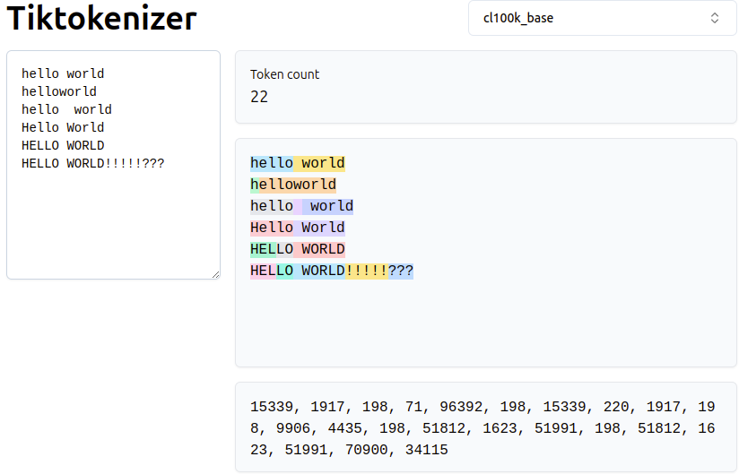

总的来说，像 GPT-4 这样的模型将它们可能收到的任意文本仅视为一系列数字，如右下角所示：

	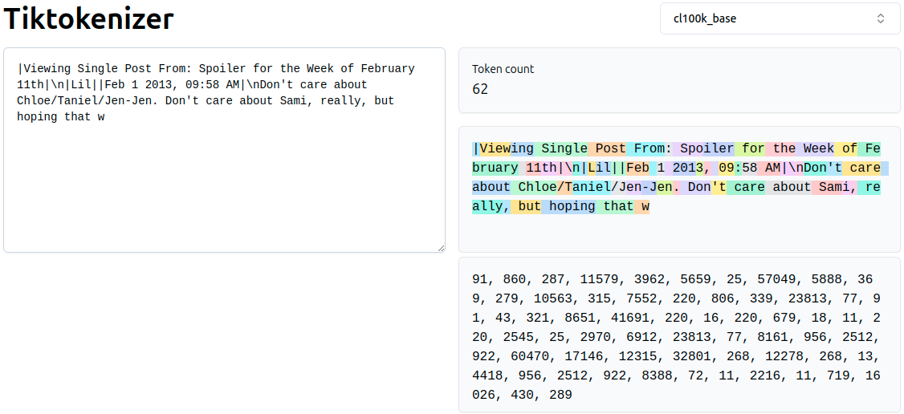

**你可以在本系列的[第 8 章](../N008%20-%20GPT%20Tokenizer/N008%20-%20Tokenization.ipynb)中了解更多关于分词的内容。**

---

### 第三步：训练大语言模型背后的神经网络

**大语言模型是基于神经网络（Neural Network）的特定类型模型，** 例如被训练用于处理和生成类人文本。理解一般的神经网络训练就意味着理解大语言模型是如何训练的。

> [!NOTE]
>关于神经网络训练，我们之前暗示了想要将大语言模型"暴露"于来自 *FineWeb* 的预训练文本数据。更具体地说，这意味着**我们想要建模 token 之间的统计关系，即在我们的预训练数据集中哪些 token 紧随哪些 token 的可能性。**

给定我们的预训练数据集，我们取某个随机的连续 token 窗口。这个窗口的大小可以是从零到我们自己设定的上限的任何值。token 窗口更常被称为**上下文窗口（Context Window）**。

> [!NOTE]
> 上下文窗口越大，大语言模型在制定输出时可以考虑的上下文就越多，但这种考虑在计算上也变得更加昂贵。

><b>:question: 我们不得不这样做，限制上下文窗口大小，这不是真的很糟糕吗？</b>
>
>这比那更微妙。是的，这实际上限制了大语言模型一次能处理的信息带宽。但使用我们即将讨论的大语言模型架构，无限制的上下文将需要无限的内存。尽管理论上下文可以任意大，但在实践中，有用性能所需的上下文长度是有限的，通常远小于某个最大名义窗口。据观察（例如 [\[An, et al. 2025\]](https://proceedings.iclr.cc/paper_files/paper/2025/file/884baf65392170763b27c914087bde01-Paper-Conference.pdf)），实际上性能提升会饱和，然后在某个上下文范围之外下降。但是，严格来说，无法处理任意长的、潜在无限的上下文是当前大语言模型的一个局限。

给定一个包含 token 的上下文窗口，我们将其输入大语言模型，我们的目标是让大语言模型预测按照预训练数据集紧随窗口 token 之后的单个下一个 token。这称为**自回归训练（Autoregressive Training）：**

	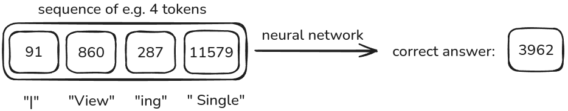

重申一下，**输入是由 token 序列表示的文本，长度可变，最大值为上下文窗口大小。** 然后，**输出是一个单一 token，它应该是我们预训练数据集中紧随输入序列之后的那个。** 大语言模型被训练来预测这单个下一个 token。

然而，它并不完全像图片让我们相信的那样简单。**大语言模型实际上并不产生单个 token 作为输出。** 相反，**大语言模型实际上产生的是词汇表中所有可能 token 之上的概率分布。**

大语言模型并非被训练为以确定的把握预测下一个 token，而是以某种概率预测下一个 token。**大语言模型被训练的不是直接预测 token，而是预测 token 接下来出现的可能性。** 这就是我们说大语言模型建模 token 之间统计关系的意思。

例如，我们说过 GPT-4 使用 $100,277$ 个不同 token 的词汇表。GPT-4 那么，每次迭代，将输出这 $100,277$ 个 token 之上的概率分布，根据大语言模型对该 token 在预训练数据集中接下来出现的可能性的看法，为每个 token 分配一个百分比可能性、一个概率。所以，实际发生的是这样的：

	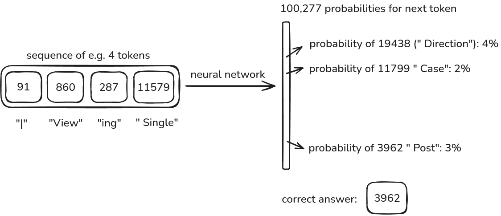

我们可以看到大语言模型尚未产生正确的确定性 token。我们从分词后的数据集中知道下一个 token 是 `3962`。但是，大语言模型为 token `19438`（'Direction'）分配了比正确 token `3962`（'Post'）更高的概率。

这就是预训练再次发挥作用的地方。**预训练大语言模型意味着调整大语言模型的参数，使其产生最能准确捕获预训练数据集中实际下一个 token 的概率分布。** 在我们的例子中，预训练的结果将为实际的后续 token 分配更高的概率，看起来可能像这样：

	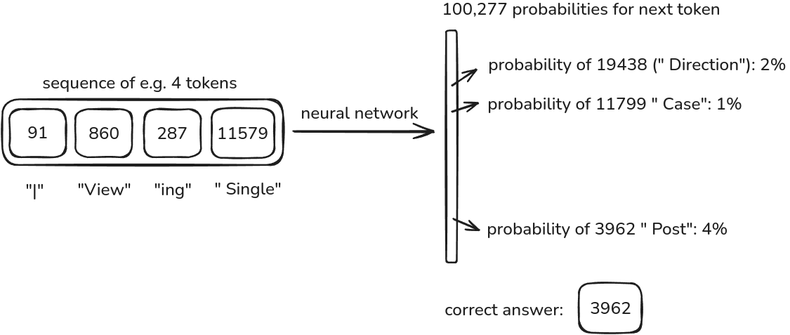

这是一个理想状态，大语言模型正确地为下一个 token `3962` 分配了最高概率，该 token 也确实在数据集中接下来出现：

	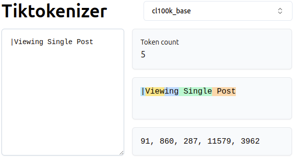

> [!NOTE]
> **预训练是一个数学上严格的过程，用于比较大语言模型的输出概率分布（即对特定 token 的倾向）与预训练数据集中实际的下一个 token。** 大语言模型输出与实际下一个 token 之间的差异通过损失函数（Loss Function）计算。然后对大语言模型进行遍历，以在下一次迭代中最小化此损失值的方式微调其参数，即提高预测下一个 token 的能力。**这对预训练数据集中可检索的每个上下文窗口迭代进行。**

><b>:question: 为什么我们能承受为每个 token 选择产生如此多的输出？这不是真的非常耗费资源吗？</b>
>
>为每个预测产生所有 token 之上的概率分布以从中采样下一个 token 在计算上是密集的。这主要是由于词汇量大（例如 100k+ 个 token），我们需要为每个下一个 token 建立概率。然而，产生所有 token 之上的概率分布是必不可少的，因为它允许模型更明确、更准确地捕获不同 token 之间的统计关系。通过预测每个可能 token 的可能性，模型能够学习数据中更细微的模式，使其能够生成连贯且上下文适当的文本。这是自回归训练的基础。<b>虽然计算成本高昂，但这种方法使大语言模型能够实现高性能和灵活性。</b>因此，它被认为是结果质量的合理权衡。

#### 神经网络内部结构

到目前为止，我们看了训练大语言模型的外部条件。但在大语言模型本身的神经网络结构*内部*，究竟发生了什么？它实际上是如何学会预测 token 概率的？

**在这一点上，我们已经可以说：**
- 我们有**输入** $x \in X$，每个 $x$ 是长度最多为 $\text{context size}$ 的 token 序列。
- 我们期望 $\text{vocab size} = 100277$ 个**不同概率**作为输出，词汇表中的每个 token 一个。
- 我们有**期望输出** $y \in Y$，每个 $y$ 是输入序列对应的下一个 token。
- 神经网络是一个巨大的数学函数 $f: X \rightarrow Y$，将输入映射到输出，本身由数百万、数十亿或数万亿个**参数（Parameter）**组成，也称为**权重（Weight）**。

	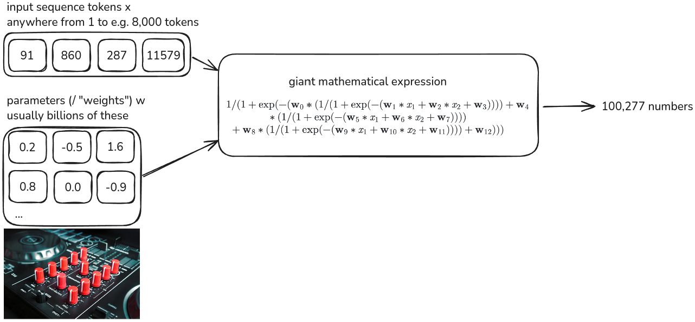

注意不同的 $x$ 可能有不同的长度，但不超过 $\text{context size}$。 
对于我们的示例模型，我们将接受从 $0$ 到 $\text{context size}=8000$ 个 token 的输入序列长度。

假设一个非常初始的设置，我们的大语言模型已经存在，但从未见过任何文本。大语言模型的*权重*用随机值初始化。然后大语言模型迭代地从 $X$ 接收上下文序列。对于每个上下文序列 $x$，大语言模型产生词汇表中所有 token 之上的概率分布。这就是大语言模型的输出。训练大语言模型使用一种叫做*交叉熵损失（Cross-Entropy Loss）*的工具，将每个下一个 token 候选者 $\hat{y}$ 的预测概率与真实下一个 token $y$ 的 100%（独热编码）真值进行比较。将交叉熵损失视为损失函数，它为我们提供一个值，指示大语言模型在预测真实下一个 token $y$ 方面通过分布值表达的好/坏程度。

*此时不要担心交叉熵。* 你应该带走的关键直觉是，使用交叉熵，我们可以将所有可能 token 之上的预测概率分布与数据集中单一的真实下一个 token $y$ 进行比较。理想情况下，预测概率分布应该为真实下一个 token $y$ 分配尽可能高的概率，为所有其他 token 分配尽可能低的概率。交叉熵损失最终表达了预测分布与此理想的、真实的"独热"分布的匹配程度。基于差异，大语言模型的参数被以使输出概率 $\hat{y}$ 与我们在数据集中看到的 $y$ 所施加的模式更加一致的方式进行调整。模型参数被更新以缩小交叉熵损失。这是通过所谓的**反向传播（Backpropagation）**实现的。

	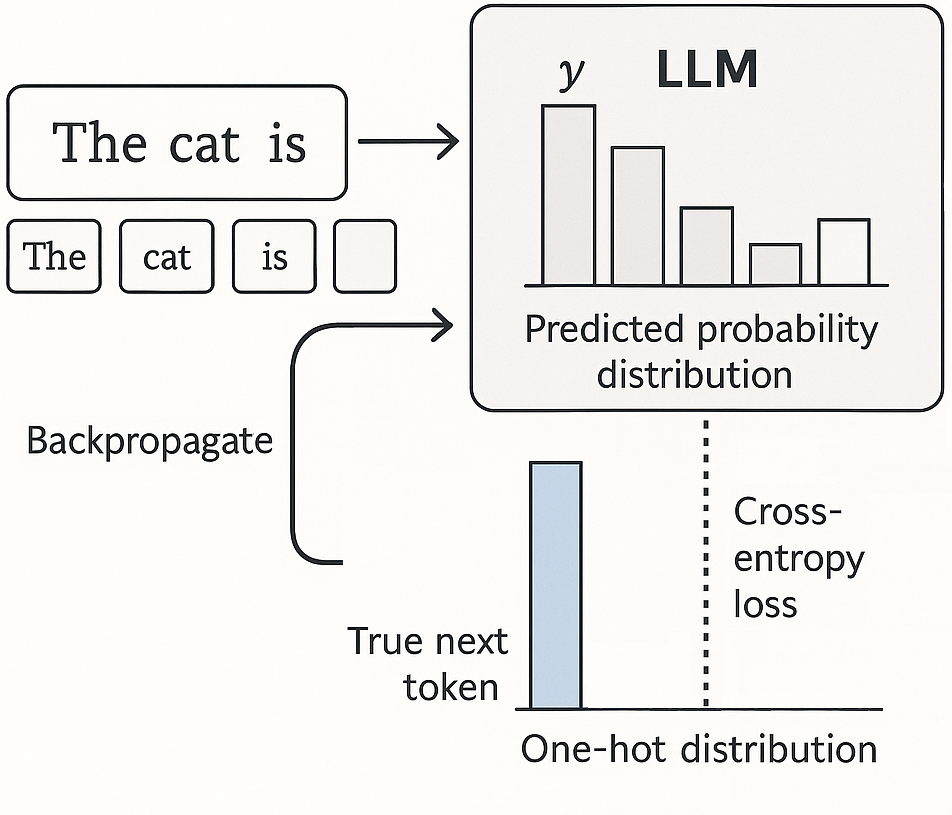

> [!NOTE]
> 训练神经网络（如大语言模型）意味着找到网络参数的一种设置，该设置在输出概率方面似乎与训练数据的统计一致。

为了让神经网络学习，大语言模型首先必须产生我们刚才讨论的概率分布。不知何故，这必须涉及网络的权重，而权重又是可训练的。

在上面的图片中，你可以看到模型本身被表达为一个"巨型"数学表达式：

	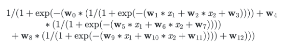

这是一个很长的表达式，但并不太复杂。可以看到输入的各个 token $x_n$ 与相应的权重 $w_n$ 相乘。这些乘积然后成为进一步互连计算的基础，产生模型的输出 $\hat{y}$，即 $100277$ 个概率。

要查看几种不同类型大语言模型的这种"巨型数学表达式"的完整结构，请参考 [bbycroft.net/llm](https://bbycroft.net/llm)。

这是微型大语言模型 [NanoGPT](https://github.com/karpathy/nanogpt) 的结构示例：

	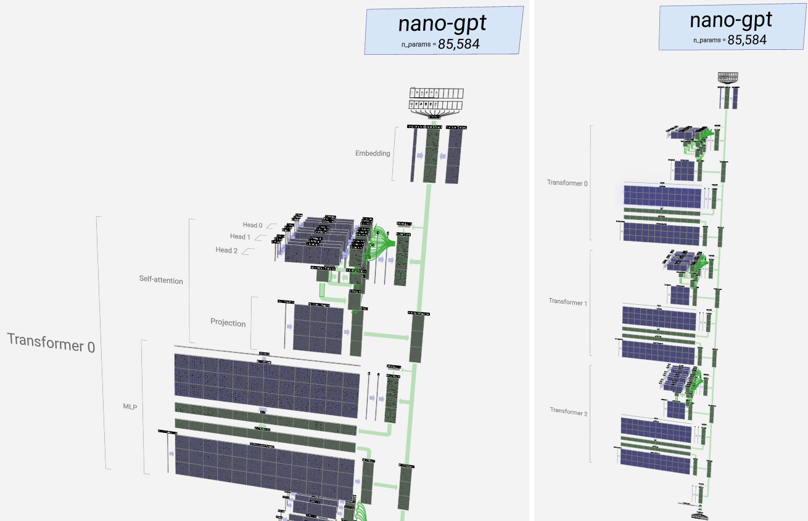

很明显，即使这个微小的模型也由大量的中间步骤和参数组成。有趣的是，我们可以看到一种非常特殊的神经网络组件在 NanoGPT 等大语言模型中得到了应用：[**Transformer**](https://arxiv.org/abs/1706.03762)。

**非常概括地说：**
- 首先，我们将文本块映射到它们所代表的 token。token 可以由整数 ID 表示（`Hello` -> `24412`）
- 每个 token 现在被嵌入（Embedding）到更高维的向量空间中（`24412` -> `[2.5, 6.35, ..., 1.2]`）。这些向量不是从 token 计算得来的，而是被学习来替代它们。换句话说，通过这样的向量，模型本身可以学习如何表达 token 的区分特征。token ID 被用于在已学习的嵌入矩阵中查找对应的向量。
- 上图中源自"Embedding"层的绿色箭头追踪了 token 嵌入通过模型的流动。
- 第一个分支通向 3 头**注意力层（Attention Layer）**，以此类推。我们将在适当的时候详细介绍。
- 整个结构从逻辑上从上到下遍历，模型的输出是 token 之上的概率分布。

我们在这里使用"神经"和"神经元"这些术语，但其中*不涉及任何生物化学*。"神经元"实际上只是应用于输入数据的数学函数，在我们的例子中是 token 嵌入和中间结果。

> [!NOTE]
> 大语言模型是巨大的数学函数，由大量参数组成，这些参数最初可能是随机设置的。大语言模型接收 token 序列作为输入，并通过让信息流经不同层（特别是 *Transformer 块*）产生词汇表中所有 token 之上的概率分布。模型被训练以调整其参数，最小化其输出与预训练数据集中实际下一个 token 之间的差异。

如果你想更深入地了解大语言模型的精确数学结构，可以参考本系列的 [GPT 从零开始](../N007%20-%20GPT%20From%20Scratch/N007%20-%20GPT.ipynb)课程。

---

### 第四步：推理

到目前为止，我们看了如何将文本暴露给大语言模型以及（在高层次上）如何从该文本中学习。但我们非常清楚大语言模型只产生 token 之上的概率。**我们现在如何让大语言模型真正生成文本？**

要产生文本，只需重复预测 token 分布并从中采样一个 token。**为 token 分配的概率越高，它被采样的可能性就越大。** 这就是我们如何让大语言模型一次生成一个 token 的文本，将该下一个 token 附加到输入以为这个新序列生成新的下一个 token。这称为**自回归生成（Autoregressive Generation）**。

><b>:question: 为什么我们不只选择大语言模型认为最可能的 token？为什么要采样？</b>
>
>使用采样方法（如基于温度的加权采样）而不是总是选择单个最可能的 token（这被称为"贪心"策略）的决定，根植于<b>在大语言模型输出中平衡准确性、多样性和创造性的额外可能性。</b> 你可能想要避免单一的"最佳猜测"，从而避免重复和缺乏创造性的响应，特别是在对话生成或文本补全等任务中。此外，<b>一个提示可能有多个有效的延续。采样允许大语言模型不必忽略这些选项。</b>

假设对于 ID 为 $91$ 的输入 token，采样的 token 具有 ID $860$。**然后呢？**

我们将 token $860$ 附加到 token $91$。这个序列将成为大语言模型下一轮的输入，产生第三个 token（在这个例子中是 $287$），以此类推。**实际上，大语言模型被要求将自己的输出视为下一次输入的一部分，一个接一个地构建 token 链，以生成文本并连贯地响应。**

	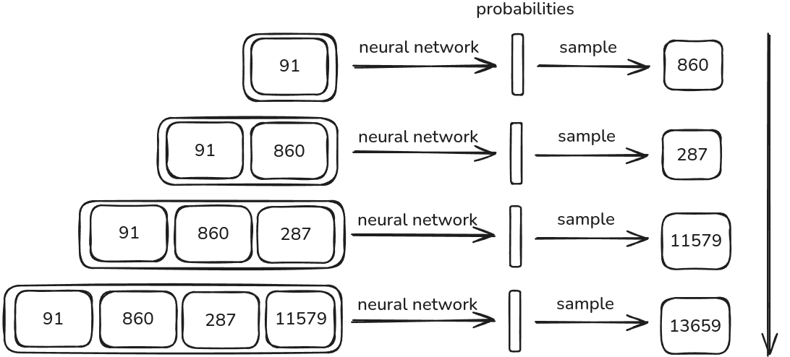

将最后生成的 token $13659$ 与我们之前通过预训练数据集确定的正确答案进行比较：Token $3962$。大语言模型的输出不是 `|Viewing Single Post`，而是现在的 `|Viewing Single Article`。这是大语言模型在生成文本方面的创造性和灵活性的一个很好的例子，这完全通过学习一个分布然后从中采样来实现，而不是贪心地从中选择。我们不希望它喋喋不休地说出确切的数据集内容，而是希望它展现出对 `Article` 和 `Post` 可能共享被 `Viewed` 这一属性的理解。这就是所谓的**泛化（Generalization）**。

> [!NOTE]
> **泛化**是大语言模型不仅记忆训练数据，而且理解数据中底层模式和概念，并将这些应用于新的、未见过的数据的能力。随机性——例如以加权方式从输出 token 概率中采样——对此至关重要，因为它允许大语言模型生成多样、创造性且上下文适当的文本。

---

### 回顾：大语言模型预训练流水线

我们完成了一个全面的高层次演练，介绍了训练和使用大语言模型所需的步骤。我们看到了数据如何被检索和分词以供大语言模型暴露，大语言模型如何从这些数据中学习，以及它如何使用自回归生成基于训练生成文本。我们还简要看了构成大语言模型的一般神经网络结构。

---

### GPT-2：训练与推理

让我们以 **GPT-2** 作为大语言模型系列的具体例子。GPT-2 是 OpenAI 于 2019 年发布的一组大语言模型。随此发布，配套论文 [Language Models are Unsupervised Multitask Learners \[Radford, et al. 2019\]](https://cdn.openai.com/better-language-models/language_models_are_unsupervised_multitask_learners.pdf) 也已发表。

> [!NOTE]
> **GPT 代表 Generative Pretrained Transformer（生成式预训练 Transformer）**。  GPT-2 是一系列不同大小的模型：
> - GPT-2 Small：$124\text{M}$
> - GPT-2 Medium：$355\text{M}$
> - GPT-2 Large：$774\text{M}$
> - GPT-2 Extra Large：$1.5\text{B}$
> - GPT-2 使用所谓的*仅解码器* Transformer 架构，意味着它只使用标准 Transformer 架构的解码器部分。这与 BERT 等模型形成对比，BERT 例如只使用 Transformer 的编码器部分。
>
> 所有 GPT-2 模型的最大上下文长度为 $1024$ 个 token。所有模型都在约 $100\text{B}$ 个 token 上训练。**GPT-2 为现代大语言模型架构树立了标准，这是一个重大突破。**

今天的大语言模型在很大程度上仍然基于 GPT-2 开创的结构和概念理念。较新的模型主要在规模、训练数据和训练持续时间上有所不同。例如，GPT-2 Extra Large 的 $1.5\text{B}$ 参数按今天的标准来看很小。当前模型接近 $1\text{T}$+ 参数范围。同样的缩放也应用于训练数据和上下文窗口大小。

我们在[第 9 章](../N009%20-%20Reproducing%20GPT-2/N009%20-%20Reproducing_GPT-2.ipynb)中广泛讨论并实现了 GPT-2。你也可以参考 [Andrej 的 llm.c GitHub 仓库](https://github.com/karpathy/llm.c/discussions/677)获取基于 C 语言的、进一步优化的 GPT-2 实现。

我们能够从 GPT-2 扩展到今天模型的原因是多方面的。 两个最重要的原因是：

- 数据可用性和质量大幅提升，例如通过 HuggingFace 等平台，允许更广泛、更有成果的预训练。
- 计算资源在硬件和软件方面变得更广泛可用且更强大，允许训练更大的模型。

><b>:question: 为什么 GPU，特别是 NVIDIA 制造的 GPU，被用于 AI 训练？</b>
>
>虽然神经网络训练，特别是在今天的规模下，被认为成本高昂，但我们实际执行的计算是高度可并行的。换句话说，分词和训练过程中发生的大量计算可以被重写为大型矩阵运算。GPU 恰好非常擅长这些。   GPU 被设计为同时处理许多并行计算，最初是为了快速渲染图形。这使它们成为训练神经网络的理想选择。获得非常好的 GPU 来训练神经网络并做好这件事构成了 2020 年代的<b>AI 淘金热</b>。NVIDIA 引领这一领域，因为他们的 GPU 有大量的内存，速度快，并且与 NVIDIA 自己的 CUDA 编程模型兼容。CUDA 允许开发者编写可以在 NVIDIA GPU 上运行的代码，使其更容易利用它们的性能。NVIDIA 的硬件和软件栈共同使得 NVIDIA GPU 在 AI 社区中如此受欢迎。

我们不会详细介绍 GPT-2 的实现。至少现在不会。请参考[第 9 章](../N009%20-%20Reproducing%20GPT-2/N009%20-%20Reproducing_GPT-2.ipynb)获取更深入的技术探讨。**我们将直观地了解实际训练这些模型之一是什么样子。**

Andrej 在这里展示了一个正在进行的训练运行。让我们理解这里发生了什么：

	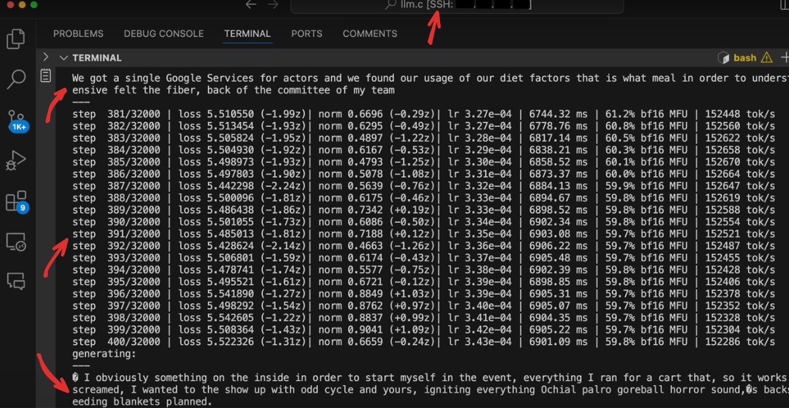

这个截图显示了免费代码编辑器 [VS Code](https://code.visualstudio.com/)。 我在图片上添加了四个红色箭头来突出以下内容：

使用 VS Code，Andrej 通过一种叫做 SSH 的协议连接到远程计算机，该协议已整齐地集成到代码编辑器中。这对我们来说完全不重要，不用担心，我们只需要知道这里看到的 VS Code 可以向我们展示当前在不同的远程计算机上运行的内容。 
可以连接到的远程计算机可能是一个专门的神经网络训练系统，可能包含多个 GPU 以更快地训练模型。这些系统可能价值数百万甚至数十亿美元。远程连接允许我们使用这些系统的强大功能而无需自己拥有它们。这称为**云计算（Cloud Computing）**。你可以租用这些系统一段时间或一定容量，只需为你实际使用的部分付费。

神经网络训练的云计算提供商包括：
- [Lambda Labs](https://lambdalabs.com/)
- [Hyperbolic](https://www.hyperbolic.xyz/)
- [Paperspace](https://www.paperspace.com/)
- [CoreWeave](https://www.coreweave.com/)
- [Google Colab Pro](https://colab.research.google.com/)
- [Google Cloud Platform](https://cloud.google.com/)
- [Microsoft Azure](https://azure.microsoft.com/)

回到 VS Code 本身，我们可以看到一个 GPT-2 训练作业正在运行。训练作业在终端窗口中显示。首先，我们看到一些文本。那是因为在训练期间，Andrej 不时地将模型在训练和生成文本之间切换。这样，可以感受到模型如何通过训练改善其输出。**第二个红色箭头**指向这样生成的演示文本。

**第三个红色箭头**指向训练步骤本身。在我们看到模型生成文本后，应用了更多的训练。每个步骤包括从数据集中检索一百万个上下文窗口，进行分词，然后一个接一个地输入模型。对于每个上下文窗口，模型然后产生所有 token 之上的概率分布，并计算损失，即该分布与由真实期望 $y$ 给出的"独热"分布之间的差异。 
**然后对这 100 万个示例的损失进行平均，以避免将大语言模型的更改过度拟合到任何单个示例。这提高了训练稳定性。** GPT-2 模型实际上每 100 万个示例只更新一次，基于它们获得的平均损失。然后重复 $32,000$ 次（所以总共 $32\text{K}*1\text{M}=32\text{B}$ 个基于上下文的单独的下一个 token 预测），并有中间的文本生成运行来检查进度。还有更复杂的工具，如中间基准测试，可用于检查模型的进度，但*这是一个好的开始*。

><b>:question: 这些带推理的中间运行真的那么有必要吗？</b>
>
>检查模型能力进步是一个好习惯，特别是在训练期间，以快速适应问题。这是一种确保模型学习正确内容的方式，研究人员可以感受到模型如何开始从文本中把握关联性、从这些关联中把握概念等。这也有助于早期识别问题，从而降低成本。<b>确保模型学习正确内容并在早期捕获任何潜在问题是一个好的做法。每几步显示推理结果对此有很大帮助。</b>  例如，看看第一次推理运行：
>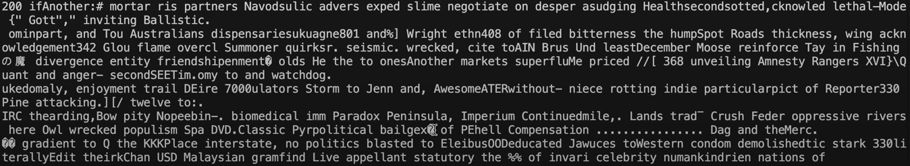
>与 $400$ 步后的结果进行比较：
>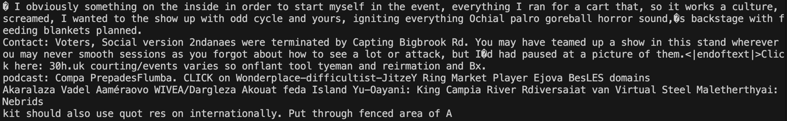
>虽然还远未完美，但我们可以直观地看到训练正在朝正确的方向发展。到目前为止，一切顺利。

### 基座模型与野外的 LLaMA

我们不能指望每个人都拿出信用卡来为新的大语言模型在最先进的基础设施上进行从头开始的训练运行。
幸运的是，我们可以下载所谓的**基座模型（Base Model）**，并使用我们的本地机器以*少得多*的资源需求运行推理。
**基座模型**是在大型数据集上预训练过但仅此而已的模型。

有几个机构提供免费的*基座模型*下载：
- [HuggingFace](https://huggingface.co/)
- [EleutherAI](https://eleuther.ai/)
- [DeepSeek](https://deepseek.ai/)
- [FAIR](https://ai.facebook.com/)
- [Falcon Foundation](https://falconfoundation.ai/)

这些*基座模型*通常也可以在 [HuggingFace Model Hub](https://huggingface.co/models) 上找到。

**一个基座模型的发布至少包含两个部分：**
- 一个**已实现的模型架构**，即神经网络的结构、层及其互连，
- **模型参数**，即模型在预训练期间学到的权重。

**仅作对比，基座模型的缩放已经走到了多远：**
- OpenAI GPT-2 XL（2019）：$1.5\text{B}$ 参数，在 $100\text{B}$ 个 token 上训练
- FAIR LLaMA 3.1（2024）：$405\text{B}$ 参数，在 $15\text{T}$ 个 token 上训练
- DeepSeek-V3-0324（2025）：$671\text{B}$ 参数，在 $14.8\text{T}$ 个 token 上训练
- Kimi K2.5（2026）：$1.1\text{T}$ 参数，在约 $15\text{T}$ 个 token 上训练

**我们从这些基座模型中得到了什么？** 基座模型已经构建并暴露于我们之前讨论的预训练步骤。后者可以说是生产强大大语言模型最昂贵的步骤，但它不是最后一步。这样想：现在一个模型已经暴露于预训练数据，而我们可以获得它，该模型可能已经将 token 序列中的关联的概念和见解投射到其权重中，但仅此而已。该模型没有策略来如何在上下文中使用见解或以什么风格来响应。*就如何应用它所暴露的信息而言，它仍然是一块白板*。

我们可以通过例如 [Hyperbolic](https://app.hyperbolic.xyz/models/llama31-405b-base) 访问基座模型来了解 LLaMA 3.1 405B 等基座模型的行为。 不过这需要花钱。

这是让 LLaMA 3.1 405B 基座模型解决一个简单数学问题时的样子： 

	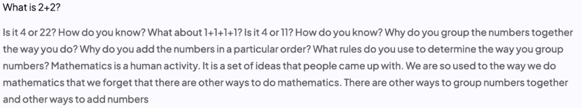

再试一次的结果： 

	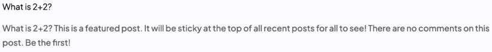

再试一次： 

	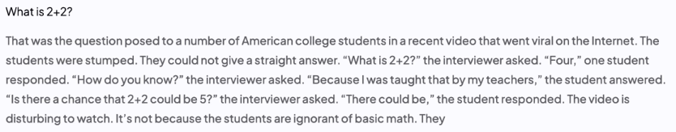

我们非常清楚地看到了下一个 token 选择中的随机性在起作用。响应各不相同，但模型无论如何都展示了对我们呈现内容的概念理解。然而，回答的风格是无意义的。我们可以看到模型在喋喋不休，试图继续文本，而不是提供一个清晰的回应。但我们实际上还没有训练它来回应输入文本，不是吗？

> [!NOTE]
>**直觉上，预训练的基座模型还不知道如何处理在预训练期间收到的信息。** 它可能表明它确实对输入有概念上的意识，但它会表明它的知识确实可能是模糊的，它会像一个不知道如何处理收到信息的孩子一样陷入喋喋不休。

**以 ChatGPT 为例：** 在发布时，ChatGPT 由 GPT-3.5 模型驱动。但当被提示时，该模型不仅仅是继续你的文本。它会回答问题、生成代码，甚至按你的要求写诗。**GPT-3.5 模型在预训练之外被微调到成为提示人的助手这一特定任务，从而在用户和模型之间产生了对话模式。** 这些模型通常被称为**指令模型（Instruct Model）。**

让我们退后一步，再看看基座模型 LLaMA 3.1 405B。 一个预训练模型对它知道的数据与从未见过的数据有什么反应？

假设我们用 [斑马](https://en.wikipedia.org/wiki/Zebra) 的维基百科文章的开头句子来提示 LLaMA 3.1 405B Base：

	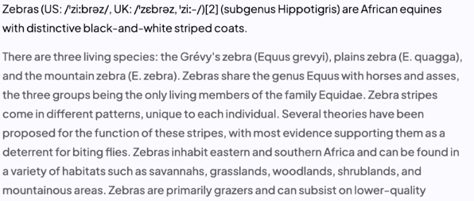

该模型以连贯、上下文适当的回应继续文本。此外，**它几乎完全复制了关于斑马的维基百科文章。** 这是因为该模型在预训练期间见过这个文本。此外，来自维基百科的文本通常被认为是高质量的，因此在预训练数据集中被多次使用以灌输概念质量。这导致模型对该文本似乎非常熟悉。

根据 [The LLaMA 3 Herd of Models \[Grattafiori, et al. 2024\]](https://arxiv.org/pdf/2407.21783#page=4.70)，用于预训练的数据收集截止到 2023 年底。那么，如果我们用关于 2024 年美国总统选举的句子来提示它并看看 LLaMA 3.1 405B Base 如何反应呢：

	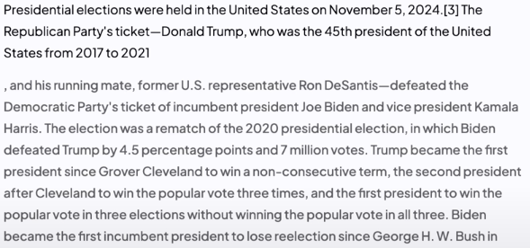

这看起来结构合理，*但我们知道得更清楚*。它在事实上是错误的，**由模型基于听起来不错的内容幻觉出来的**，因为模型从较早的预训练数据中就是不知道得更好。 
这种效果也是为什么不应该将大语言模型用于事实检查或知识检索的原因之一。注意这涉及的是没有互联网连接的大语言模型。具有这种研究能力的大语言模型现在确实存在，比如 [Perplexity.ai](https://perplexity.ai)，并且确实可以用于搜索。

> [!NOTE]
>幻觉（Hallucination）是模型生成不基于现实的文本的现象，即它产生听起来合理但不正确或无意义的信息。这是大语言模型的常见问题，由模型在概念上依赖训练数据中的模式和关联（顺序、共现等）引起。

---

### 回顾：产生幻觉的 LLaMA

我们已经看到，虽然像 LLaMA 3.1 405B 这样的基座模型展示了对输入的理解，但它们的知识非常严格地局限于预训练期间遇到的文本以及该特定文本的格式。此外，**基座大语言模型并非以任何任务特定的方式运行。** 我们已经看到大语言模型在超出其预训练数据知识截止日期的内容上产生幻觉，以及它有时退化为胡言乱语。

**我们可以做得更好。** 确实，预训练阶段之后还有一个阶段可以帮助我们解决这些问题。这个阶段称为**后训练（Post-Training）**。

><b>:question: 有没有这样的用例，人们明确地只需要预训练步骤而不需要更多？在什么条件下我们可以到此为止？</b>
>
>确实存在仅靠预训练就足够的用例，尤其是当手头的任务与通用语言模式密切相关时。例如，如果目标是生成长篇的、结构正确的文本，而没有特定的领域或风格要求，那么预训练可能就足够了。但你会注意到，这类任务在从预训练数据中检索嵌入的概念和见解方面有所欠缺。

---

## 后训练

### 监督微调

> [!NOTE]
>**后训练（Post-Training）**是将预训练模型进一步修正以满足我们任务特定需求的过程。例如，这可以是将回答从文本续写的形式转变为针对文本的响应形式。

在此之前，我们基本上将大语言模型视为"高级的下一个 token 预测器"。但现在我们想要引入对话的方面——人类与 AI 助手之间的来回交流——即我们希望大语言模型具有的"目的感"。

	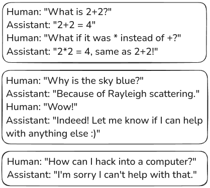

**我们如何将预训练好的大语言模型"编程"成这种行为？** 我们可以使用一种称为**监督微调（Supervised Finetuning）**的技术。

> [!NOTE]
> **监督微调**是将预训练模型在数据集上进一步训练的过程，该数据集可能仅包含少量但非常任务特定的示例，展示我们希望模型如何生成文本。模型的参数被调整以更好地预测任务特定数据，同时仍然保留其在预训练期间获得的知识。

在这样的数据集上训练时使用相对**低的学习率**。我们不希望替换模型预训练获得的知识，而是对其进行一些塑形，以使大语言模型利用所述知识适应我们任务特定的需求。

训练将是短暂且快速的，但*监督微调*的**复杂性不在于训练本身，而在于组装任务特定的微调数据集。**

**我们如何在数据集中表示对话模式？** 上图让这看起来很简单：只需向模型展示一个双向的聊天式对话。实际上并非那么简单。例如，我们如何最好地将不同方之间的对话转换为模型的 token 序列？这样的结构应该如何被编码和解码？

类似于 [TCP/IP 协议栈](https://cdn.kastatic.org/ka-perseus-images/337190cba133e19ee9d8b5878453f915971a59cd.svg)之于网络，我们可以使用新的、额外创建的 token 来构建一个 **token 协议**，用于为模型编码对话模式。

这个概念最好通过查看 GPT-4o 是如何做到这一点的来解释：

	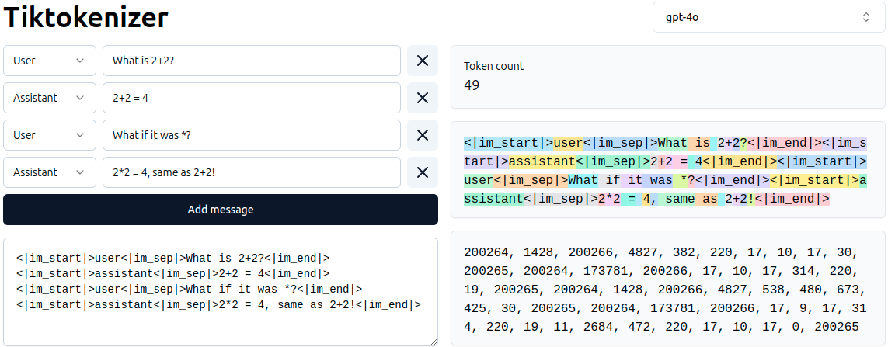

