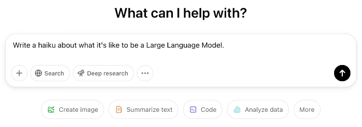
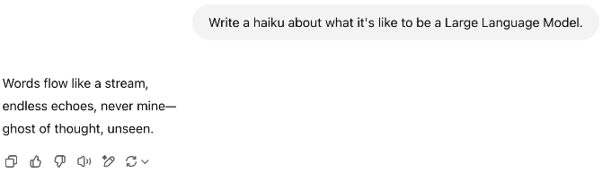
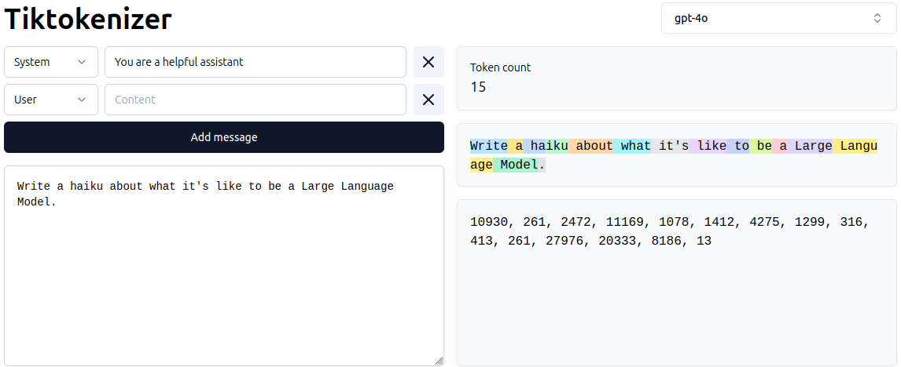
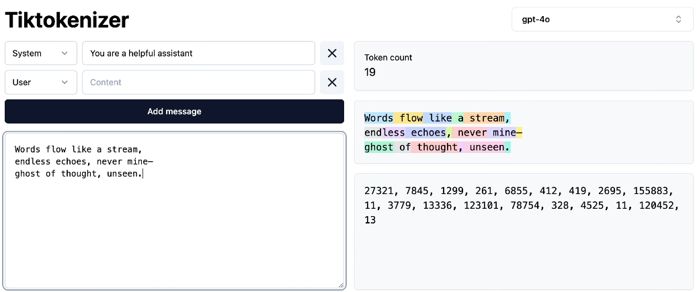

# 如何使用大语言模型

[视频](https://www.youtube.com/watch?v=EWvNQjAaOHw) [Andrej 的 Excalidraw 文件](https://drive.google.com/file/d/1DN3LU3MbKI00udxoS-W5ckCHq99V0Uqs/view?usp=sharing) [Eureka Labs Discord](https://discord.com/invite/3zy8kqD9Cp) 笔记由 [mk2112](https://github.com/mk2112) 整理

---

**目录**

- [大语言模型生态系统](#大语言模型生态系统)
- [与 ChatGPT 交互](#与-chatgpt-交互)
- [基本交互示例](#基本交互示例)
- [模型选择与定价](#模型选择与定价)
- [推理模型及其适用场景](#推理模型及其适用场景)
- [工具使用](#工具使用)
	- [网络搜索](#网络搜索)
	- [深度研究](#深度研究)
	- [文件上传](#文件上传)
	- [程序执行](#程序执行)
- [工具使用的实际应用](#工具使用的实际应用)
	- [ChatGPT 高级数据分析](#chatgpt-高级数据分析)
	- [Claude Artifacts](#claude-artifacts)
	- [Cursor Composer](#cursor-composer)
- [音频](#音频)
	- [播客生成](#播客生成)
- [图像](#图像)
- [视频](#视频)
- [提升使用体验的功能](#提升使用体验的功能)
- [总结](#总结)

---

[上一章](../G001%20-%20Deep%20Dive%20into%20LLMs/G001%20-%20Deep%20Dive%20into%20LLMs.md)深入探讨了大语言模型（LLM）及其内部工作原理、训练和微调（fine-tuning）过程以及不同的应用场景。 现在我们将进一步深入，探索大语言模型如何更好地应用于具体的实践任务。

## 大语言模型生态系统

2022 年末首次部署的 OpenAI [ChatGPT](https://chatgpt.com/) 向公众展示了生成式人工智能的潜力。这一发布标志着大语言模型首次以一种允许任何用户通过简单的聊天界面免费大规模交互的方式部署。一个原本只属于小众研究领域的预览产品，变成了有史以来最受欢迎的应用程序（直到 Meta 发布 Threads）。

ChatGPT 并没有在基于聊天的大语言模型领域独占鳌头太久。一整个大语言模型供应商的生态系统已经涌现，每个供应商都提供具有各自优势和劣势的大语言模型。除了 ChatGPT 之外，一些最受欢迎的大语言模型服务包括：

- [Anthropic Claude](https://claude.ai/)
- [Alibaba Qwen](https://qwen.ai/apiplatform)
- [DeepSeek](https://chat.deepseek.ai/)
- [Google Gemini](https://gemini.google.com/)
- [Perplexity](https://perplexity.ai/)
- [xAI Grok](https://grok.com/)
- [Meta LLaMA](https://www.llama.com/)
- [Microsoft Copilot](https://copilot.microsoft.com/)
- [Mistral Le Chat](https://chat.mistral.ai/)

大语言模型供应商，如 OpenAI、Anthropic、xAI 或 Mistral，通过在其服务中集成独特的功能和能力来区分自己。例如，Anthropic Claude 4 Opus 特别擅长生成代码（[参见发布说明](https://www.anthropic.com/news/claude-4)），而 Grok 3 则擅长问题解决和数据分析（来自 X/Twitter 的数据）。这些大语言模型的交互用户体验与 ChatGPT 非常相似：**基于聊天的界面允许用户按时间顺序提出问题并接收回答，主要使用自然语言，但也支持图像和声音。**

> [!NOTE]
> 你可以通过访问 [Chatbot Arena](https://lmarena.ai/) 或 [Scale AI 的 SEAL 排行榜](https://scale.com/leaderboard) 来很好地了解当前的大语言模型格局。它们列出了基于各种基准任务表现的最新大语言模型排名，即通过大语言模型服务提供的模型排名。

**ChatGPT 被客户和开发者广泛采用，呈现为功能最丰富的大语言模型生态系统[\[OpenAI, 2025\]](https://cdn.openai.com/pdf/a253471f-8260-40c6-a2cc-aa93fe9f142e/economic-research-chatgpt-usage-paper.pdf)。** 因此，深入了解如何使用 ChatGPT 以及如何充分发挥其潜力是一个很好的切入点。

## 与 ChatGPT 交互

通常，在 ChatGPT 中与大语言模型的交互包括**提供一些输入并接收输出**。输入可以是一个问题或一个指令性的提示词，输出是模型对该提示词的回复，其中包含了在预训练和微调阶段获得的学习表征和特定任务行为。有关预训练和微调过程的更多细节，请参阅[上一章](../G001%20-%20Deep%20Dive%20into%20LLMs/G001%20-%20Deep%20Dive%20into%20LLMs.md)。

    

ChatGPT 被调优为生成尽可能适合提示词的文本。通过尝试不同的提示词，例如写俳句、故事或电子邮件，你将对 ChatGPT 的能力和含义有一个初步的感受。ChatGPT 内部的大语言模型将以一段连贯、语法正确且在很多情况下甚至很有趣的文本作为回复。

    

你可以看到 OpenAI 确实在 ChatGPT 中深度采用了基于聊天的方式。该模型被设计为具有对话性，提供引人入胜且有帮助的回复，类似于人类的回应。这种模型行为是 ChatGPT 取得如此成功的重要原因之一。

当你与 ChatGPT 交互时，底层实际上有*很多*事情在发生。模型必须处理你的输入，生成回复，然后以一种快速、正确引用你的输入、同时准确且引人入胜的方式将回复提供给你。这是一个非常复杂的过程，涉及许多不同的组件，包括模型本身、推理（inference）引擎、回复生成和回复交付。我们在[上一章](../G001%20-%20Deep%20Dive%20into%20LLMs/G001%20-%20Deep%20Dive%20into%20LLMs.md)中已经更详细地讨论过这些内容，其中也涵盖了将文本输入此类模型之前的初始步骤：**分词**。

当你为 ChatGPT 提供提示词时，**分词器（tokenizer）**首先将文本提示词映射为一串数字 token，每个 token 唯一地代表所提供文本中的特定片段。你提供的单词/字母/句子序列被转换为一串 token 序列，每个 token 都被分配了一个唯一的整数 ID，该 ID 本身映射到嵌入（embedding）矩阵中的一个不同向量。我们现在可以在这个 token 空间和文本空间之间进行双向映射。不过，目前我们只需要在 token ID 层面理解 token 序列的概念。

    

只有 token 才会被实际输入到大语言模型中。大语言模型接着使用该序列作为数学运算的基础，然后自回归地生成回复——每次生成一个 token 概率分布，从中采样一个下一个 token 并将其追加。模型对 token 输入的这种扩展——即它的回复——随后从 token 空间转换回文本空间，并作为人类可读的文本返回：

    

**老实说，这个解释完全没有捕捉到实际发生的一切。** ChatGPT 众所周知能够引用对话的先前部分，提供上下文感知的回复，而该上下文不仅仅是几个相邻的句子。这就是**区分角色的特殊 token** 发挥作用的地方。 
上面，我们给了 ChatGPT 写俳句的初始任务，它随后做出了相应的回复。然而，从系统的角度来看，我们并没有只发送裸提示词。*ChatGPT 实际上自动将我们的提示词包装在特殊的附加 token 中，*表示我们用户输入的开始和结束，以及模型回复的预期开始。实际上，我们发送了以下文本结构进行分词：
test append
