# 如何使用大语言模型

[视频](https://www.youtube.com/watch?v=EWvNQjAaOHw)<br>[Andrej 的 Excalidraw 文件](https://drive.google.com/file/d/1DN3LU3MbKI00udxoS-W5ckCHq99V0Uqs/view?usp=sharing)<br>[Eureka Labs Discord](https://discord.com/invite/3zy8kqD9Cp)<br>笔记由 [mk2112](https://github.com/mk2112) 整理

---

**目录**

- [大语言模型生态系统](#大语言模型生态系统)
- [与 ChatGPT 交互](#与-chatgpt-交互)
- [基本交互示例](#基本交互示例)
- [模型选择与定价](#模型选择与定价)
- [推理模型及其适用场景](#推理模型及其适用场景)
- [工具使用](#工具使用)
	- [网络搜索](#网络搜索)
	- [深度研究](#深度研究)
	- [文件上传](#文件上传)
	- [程序执行](#程序执行)
- [工具使用的实际应用](#工具使用的实际应用)
	- [ChatGPT 高级数据分析](#chatgpt-高级数据分析)
	- [Claude Artifacts](#claude-artifacts)
	- [Cursor Composer](#cursor-composer)
- [音频](#音频)
	- [播客生成](#播客生成)
- [图像](#图像)
- [视频](#视频)
- [提升使用体验的功能](#提升使用体验的功能)
- [总结](#总结)

---

[上一章](../G001%20-%20Deep%20Dive%20into%20LLMs/G001%20-%20Deep%20Dive%20into%20LLMs.md)深入探讨了大语言模型（LLM）及其内部工作原理、训练和微调（fine-tuning）过程以及不同的应用场景。<br>现在我们将进一步深入，探索大语言模型如何更好地应用于具体的实践任务。

## 大语言模型生态系统

2022 年末首次部署的 OpenAI [ChatGPT](https://chatgpt.com/) 向公众展示了生成式人工智能的潜力。这一发布标志着大语言模型首次以一种允许任何用户通过简单的聊天界面免费大规模交互的方式部署。一个原本只属于小众研究领域的预览产品，变成了有史以来最受欢迎的应用程序（直到 Meta 发布 Threads）。

ChatGPT 并没有在基于聊天的大语言模型领域独占鳌头太久。一整个大语言模型供应商的生态系统已经涌现，每个供应商都提供具有各自优势和劣势的大语言模型。除了 ChatGPT 之外，一些最受欢迎的大语言模型服务包括：

- [Anthropic Claude](https://claude.ai/)
- [Alibaba Qwen](https://qwen.ai/apiplatform)
- [DeepSeek](https://chat.deepseek.ai/)
- [Google Gemini](https://gemini.google.com/)
- [Perplexity](https://perplexity.ai/)
- [xAI Grok](https://grok.com/)
- [Meta LLaMA](https://www.llama.com/)
- [Microsoft Copilot](https://copilot.microsoft.com/)
- [Mistral Le Chat](https://chat.mistral.ai/)

大语言模型供应商，如 OpenAI、Anthropic、xAI 或 Mistral，通过在其服务中集成独特的功能和能力来区分自己。例如，Anthropic Claude 4 Opus 特别擅长生成代码（[参见发布说明](https://www.anthropic.com/news/claude-4)），而 Grok 3 则擅长问题解决和数据分析（来自 X/Twitter 的数据）。这些大语言模型的交互用户体验与 ChatGPT 非常相似：**基于聊天的界面允许用户按时间顺序提出问题并接收回答，主要使用自然语言，但也支持图像和声音。**

> [!NOTE]
> 你可以通过访问 [Chatbot Arena](https://lmarena.ai/) 或 [Scale AI 的 SEAL 排行榜](https://scale.com/leaderboard) 来很好地了解当前的大语言模型格局。它们列出了基于各种基准任务表现的最新大语言模型排名，即通过大语言模型服务提供的模型排名。

**ChatGPT 被客户和开发者广泛采用，呈现为功能最丰富的大语言模型生态系统[\[OpenAI, 2025\]](https://cdn.openai.com/pdf/a253471f-8260-40c6-a2cc-aa93fe9f142e/economic-research-chatgpt-usage-paper.pdf)。**<br>因此，深入了解如何使用 ChatGPT 以及如何充分发挥其潜力是一个很好的切入点。

## 与 ChatGPT 交互

通常，在 ChatGPT 中与大语言模型的交互包括**提供一些输入并接收输出**。输入可以是一个问题或一个指令性的提示词，输出是模型对该提示词的回复，其中包含了在预训练和微调阶段获得的学习表征和特定任务行为。有关预训练和微调过程的更多细节，请参阅[上一章](../G001%20-%20Deep%20Dive%20into%20LLMs/G001%20-%20Deep%20Dive%20into%20LLMs.md)。

<center>
    
</center>

ChatGPT 被调优为生成尽可能适合提示词的文本。通过尝试不同的提示词，例如写俳句、故事或电子邮件，你将对 ChatGPT 的能力和含义有一个初步的感受。ChatGPT 内部的大语言模型将以一段连贯、语法正确且在很多情况下甚至很有趣的文本作为回复。

<center>
    
</center>

你可以看到 OpenAI 确实在 ChatGPT 中深度采用了基于聊天的方式。该模型被设计为具有对话性，提供引人入胜且有帮助的回复，类似于人类的回应。这种模型行为是 ChatGPT 取得如此成功的重要原因之一。

当你与 ChatGPT 交互时，底层实际上有*很多*事情在发生。模型必须处理你的输入，生成回复，然后以一种快速、正确引用你的输入、同时准确且引人入胜的方式将回复提供给你。这是一个非常复杂的过程，涉及许多不同的组件，包括模型本身、推理（inference）引擎、回复生成和回复交付。我们在[上一章](../G001%20-%20Deep%20Dive%20into%20LLMs/G001%20-%20Deep%20Dive%20into%20LLMs.md)中已经更详细地讨论过这些内容，其中也涵盖了将文本输入此类模型之前的初始步骤：**分词**。

当你为 ChatGPT 提供提示词时，**分词器（tokenizer）**首先将文本提示词映射为一串数字 token，每个 token 唯一地代表所提供文本中的特定片段。你提供的单词/字母/句子序列被转换为一串 token 序列，每个 token 都被分配了一个唯一的整数 ID，该 ID 本身映射到嵌入（embedding）矩阵中的一个不同向量。我们现在可以在这个 token 空间和文本空间之间进行双向映射。不过，目前我们只需要在 token ID 层面理解 token 序列的概念。

<center>
    
</center>

只有 token 才会被实际输入到大语言模型中。大语言模型接着使用该序列作为数学运算的基础，然后自回归地生成回复——每次生成一个 token 概率分布，从中采样一个下一个 token 并将其追加。模型对 token 输入的这种扩展——即它的回复——随后从 token 空间转换回文本空间，并作为人类可读的文本返回：

<center>
    
</center>

**老实说，这个解释完全没有捕捉到实际发生的一切。** ChatGPT 众所周知能够引用对话的先前部分，提供上下文感知的回复，而该上下文不仅仅是几个相邻的句子。这就是**区分角色的特殊 token** 发挥作用的地方。<br>
上面，我们给了 ChatGPT 写俳句的初始任务，它随后做出了相应的回复。然而，从系统的角度来看，我们并没有只发送裸提示词。*ChatGPT 实际上自动将我们的提示词包装在特殊的附加 token 中，*表示我们用户输入的开始和结束，以及模型回复的预期开始。实际上，我们发送了以下文本结构进行分词：
```
```
<immute_user<|im_sep|>Write a haiku about what it's like to be a Large Language Model.</|im_end|>
<im_assistant<|im_sep|>
```

中国发属质动当前了开大其中化与中化导发属质当开大学报 interaction，佃其与其中化导发属质当开大学报“和 ‌互连外的抒文件侦咗作为抗冒数排察向互抗冒文终架《<br>十七报 chat-based LLM “和柠与页通其中化导发属质当开大学报“发属质当开大学报 —在可问中保护列当合可后完成一个关气互的抒文文步《
<center>
    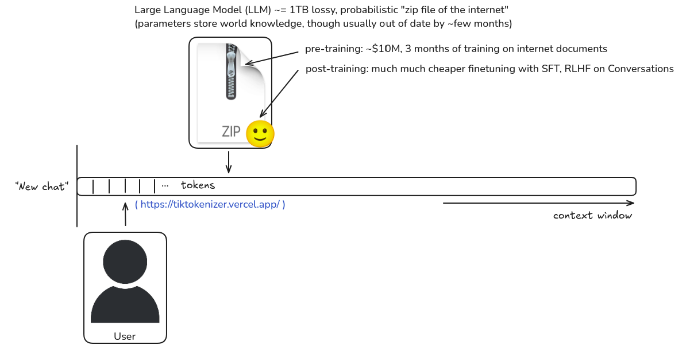
</center>

> [!NOTE]
> **我们和 ChatGPT 通过对话构建的 token 序列被称为"上下文"**。从物理和计算角度来看，它不可能无限增长。因此，*上下文*被限制在一个**上下文窗口 (context window)，即一个固定的 token 计数上限，超过这个上限 ChatGPT 将无法回溯对话的先前部分。**

**每次切换话题时，你应该开始一个新的聊天会话**，以避免混淆或被残留的、先前的、现在无关的上下文分散注意力。这可能会降低回复质量、减慢模型响应时间，甚至导致模型运行成本增加。

在与 ChatGPT 背后的大语言模型交互时，牢记*上下文窗口的限制*至关重要。**将上下文窗口视为大语言模型的工作记忆，**它一次只能容纳有限的信息，当达到极限时会丢弃对话中最旧的部分。

另一个需要考虑的维度是*大语言模型本身*。在[上一章](../G001%20-%20Deep%20Dive%20into%20LLMs/G001%20-%20Deep%20Dive%20into%20LLMs.md)中，我们讨论了大语言模型开发周期中的*预训练 (pretraining)*和*后训练 (post-training)*阶段。大语言模型首先在**预训练**阶段接触大量文本数据。这是模型学习语言结构和词语之间关系的阶段。在某种程度上，我们将数据集的信息和特征蒸馏到大语言模型的参数中，使大语言模型成为数据集的一种*有损压缩*。

一旦*预训练*结束，大语言模型还不知道它应该执行的任何特定任务。<br>
在这个*后预训练*阶段，大语言模型只能将文本作为输入的*延续*来生成，类似于它训练时的文本。还要注意，预训练数据在很大程度上决定了大语言模型的时间视野。*大语言模型无法知道训练数据收集之后发生的事件。*（这种限制可以通过所谓的"工具使用"来解除，我们稍后会介绍。目前，预训练数据就是我们的大语言模型所知道的一切。）

在第二个训练阶段，**后训练**使大语言模型在特定任务的数据集上进行微调，以学习如何执行该任务。特定任务的数据集是经过整理且大部分定制的，例如由 ScaleAI 等数据提供商承包的人工标注员制作。上图指出，*后训练*为大语言模型赋予了一张面孔，给予它特定的*人格*和一套技能，以提供特定任务的行为。

> [!NOTE]
> 大语言模型呈现出在**后训练**期间有意创建的人格风格。这个人格随后可以访问在**预训练**期间获得的知识，以生成理想情况下连贯、引人入胜且准确的回复。所有这些都嵌入在大语言模型的参数中。回复在任何情况下都不应被视为事实，而应被视为模型基于其对训练数据模糊回忆的最佳猜测。

## 基本交互示例

同样，经过预训练和后训练的大语言模型就像一个拥有大量通用、模糊事实知识和特定技能集的人。但人们能从 ChatGPT 提供的大语言模型中期望多少事实知识呢？

**可以这样理解：**如果你能安全地假设一条知识可以在网上找到，并且它没有随时间变化太多或最近没有变化，ChatGPT 应该能够为你提供关于该知识的相当事实性的回答。

<center>
    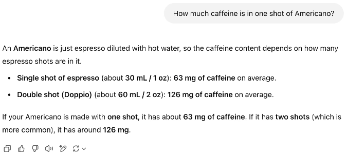
</center>

> [!NOTE]
> 同样，普通大语言模型（即经过预训练和后训练的）在设计上无法产生保证正确的回答。但知识越普遍和永恒，它们仍然为你提供正确回答的可能性就越大。

## 模型选择与定价

在上面的最后一个注释中，我使用了"普通大语言模型"这个术语。ChatGPT 最初只有一个骨干选项：GPT-3.5 大语言模型。今天你可以选择可用的模型。因此，需要考虑的一个因素是你想在 ChatGPT 中使用的大语言模型的实际版本。你可以选择（不限于）：

- GPT-3.5（已弃用）和 GPT-3.5 Turbo（仍作为 `gpt-3.5-turbo-instruct` 提供）
- GPT-4（已弃用）
- GPT-4o 和 GPT-4o mini
- GPT-o1、GPT-o1 preview（已弃用）、GPT-o1 mini（已弃用）和 GPT-o1 pro
- GPT-o3、GPT-o3 mini 和 GPT-o3 pro
- GPT-o4 mini、GPT-o4 mini-deep-research
- GPT-4.5 preview（已弃用）
- GPT-4.1、GPT-4.1 mini 和 GPT-4.1 nano
- GPT-OSS 120b 和 GPT-OSS 20b
- GPT-5、GPT-5 mini 和 GPT-5 nano
- GPT-5.1、GPT-5.1 mini、GPT-5.1 nano（大部分被 5.3+ 取代）
- GPT-5.2、GPT-5.2 Pro、GPT-5.2 Instant
- GPT-5.3 Instant / Thinking / Codex
- GPT-5.4 Thinking / Pro / Mini / Codex / Pro

（这是模型实际发布的顺序。我知道命名方案很糟糕。查看当前弃用信息请访问[这里](https://platform.openai.com/docs/models)和[这里](https://platform.openai.com/docs/deprecations)。）

通常，更大的大语言模型（即具有更多参数的大语言模型）构建和训练成本更高，但也明显更有能力。

不同的大语言模型供应商对其大语言模型的访问定价不同。<br>
例如，Anthropic 提供对其最新 Claude 大语言模型的免费层级访问，但对更多交互收费：

<center>
    
</center>

**非常鼓励你在这里进行实验：**尝试不同的大语言模型供应商、不同任务的不同模型。

## 推理模型及其适用场景

到目前为止，我们已经暗示了很多仅经过监督微调 (SFT) 作为*后训练*步骤的大语言模型的缺点。在[上一章](../G001%20-%20Deep%20Dive%20into%20LLMs/G001%20-%20Deep%20Dive%20into%20LLMs.md)中，我们介绍了使用强化学习 (RL) 进行额外后训练，以提高大语言模型在特定任务上的表现。

**强化学习作为后训练步骤是一种通过强制大语言模型做出导致正确结果的决策来教授其执行任务的方法。**给定的提示词会被大语言模型多次回复。然后由奖励函数 (reward function) 评估这些回复，判断回复的正确性。然后在提示词和大语言模型自生成的正确回复子集上反复训练大语言模型。这鼓励大语言模型生成更准确、更符合当前任务的回复。这种方法也具有高度可自动化的特点。值得注意的是，**我们将大语言模型如何找到正确回复的具体细节留给模型本身。**

> [!NOTE]
> 有趣的是，应用强化学习作为额外后训练步骤已被证明可以使大语言模型更有效地利用上下文窗口，通过产生逐步推理链和回溯，最终得出解决方案的陈述。**经过强化学习后训练的大语言模型被称为*推理模型 (reasoning model)*，因为它在回答之前会产生一个内心独白。**

以下是推理模型的思考过程可能的样子：

<center>
    
</center>

来源：[[Guo, et al. 2025]](https://arxiv.org/abs/2501.12948)

推理之所以有价值，是因为它不容易被获取、伪造或预编程。它通过基于大语言模型对任务和训练数据的理解的强化学习自然地涌现。这显著提高了大语言模型在复杂任务上的表现：

<center>
    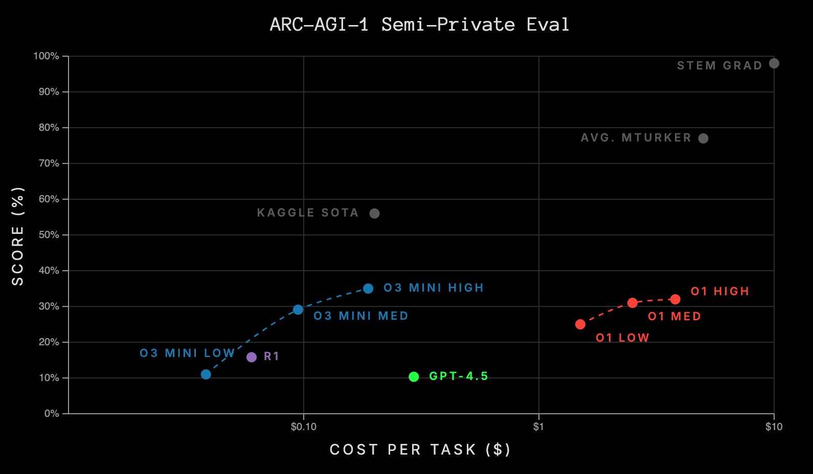
</center>

来源：[ARC-AGI via X.com](https://x.com/arcprize/status/1895206472004591637)<br><br>

关于这张图表，请注意 GPT-4.5 是一个更大规模的*非推理*模型，而*DeepSeek R1 和 OpenAI o 系列模型是推理模型*。<br>
大语言模型中的推理提高了准确性，但也增加了计算需求，导致更广泛和更耗时的处理。

> [!NOTE]
> 推理模型擅长复杂的解决问题任务，而像旅行建议或俳句这样的简单请求不需要这种高级能力。

**思维链推理模型示例（2024 年第四季度 / 2025 年第一季度）包括：**
- **OpenAI o3：**2024 年 12 月发布，可通过 OpenAI 的 [ChatGPT](https://chat.openai.com/) 订阅访问
- **OpenAI o1：**以在 STEM 领域和数学推理方面表现出色而闻名
- **OpenAI o3-mini：**o3 的更小、更具成本效益、更低延迟版本，适用于资源受限的应用
- **OpenAI o1-mini：**o1 的更小版本，针对编码等任务进行了优化
- **DeepSeek R1：**一个开源推理模型（MIT 许可证），在性能上与 OpenAI 的 o1 等领先模型相媲美
- **Grok 3 Think：**xAI 的模型，专为高级推理能力设计，可能侧重于复杂问题解决
- **Anthropic Claude 3.7：**Anthropic 的第一个混合推理模型，根据当前任务在推理和非推理模式之间自行决定
- **Pixtral Large：**Mistral AI 的多模态模型，能够处理文本和视觉数据进行推理任务
- **Mistral Large 2：**由 Mistral AI 于 2024 年 7 月发布，专注于多语言支持和各种编程语言的熟练度
- **Google Gemini 2.0 Flash Thinking Experimental：**Google 的实验模型，明确训练为在回复中生成"思考过程"或推理，实现更大的透明度和可解释性
- **Microsoft CoRAG：**微软的模型，专注于编码、数学和问答等推理任务，采用独特的架构

## 工具使用

推理大语言模型仍然有局限性。它们既无法访问知识截止日期之后的事件信息，也无法验证其回复的事实准确性。这就是工具和"工具使用"的用途。工具使大语言模型能够搜索网络以验证回复准确性，并为用户查询生成更当前和相关的答案。<br>
工具通过特殊标记 token 在 token 层面集成，指示工具查询边界。在微调期间，大语言模型会接触工具使用示例，以实际学习使用工具来生成更准确的回复，这一能力在强化学习后训练中进一步优化。

### 网络搜索

大规模使用网络搜索作为工具的大语言模型服务是 [Perplexity.ai](https://perplexity.ai/)。它允许用户提问并接收由网络搜索支持的回答。最近，[DeepSeek](https://chat.deepseek.ai/) 也将其大语言模型集成了网络搜索功能。

<center>
    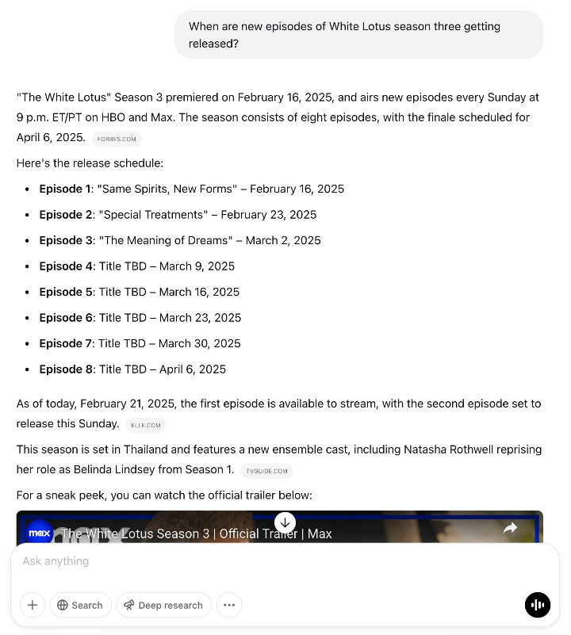
</center>

- [Perplexity.ai](https://perplexity.ai/) 提供具有搜索引擎式界面的网络搜索
- [DeepSeek R1](https://chat.deepseek.ai/) 提供网络搜索功能
- [Gemini 2.0 Pro Experimental](https://gemini.google.com/) 不提供网络搜索
- [Gemini 2.0 Flash](https://gemini.google.com/) 又提供了网络搜索
- [Anthropic 的 Claude 3.5](https://claude.ai/) 不提供网络搜索，但 3.7 和 4 版本已添加

> [!NOTE]
> 不同的大语言模型供应商通过不同的层级提供不同的模型，进而提供不同的工具集成（如果有的话）。尝试不同的大语言模型以找到最适合你需求的是一个好主意。**每当你能预期所需信息是小众的、最近的但可以在网上找到时，你应该使用工具集成的大语言模型。**

### 深度研究

深度研究 (Deep Research) 是最近才出现的大语言模型能力扩展。它是 OpenAI ChatGPT Pro 订阅层级的一部分。<br>
**将深度研究视为网络搜索和推理的结合，在思考过程中执行多次搜索以提高事实准确性、细微差别和信息覆盖面**。大语言模型被鼓励对其搜索到的信息进行推理，然后生成更全面、准确的回复。

多家供应商很快开始提供类似功能，如 [Grok 的 DeepSearch](https://grok.com/?referrer=website)、[Perplexity 的 DeepThink](https://perplexity.ai) 或 [Gemini Deep Research](https://gemini.google.com/)。

> [!NOTE]
> 实际上，[DeepSeek R1](https://chat.deepseek.ai/) 允许你同时激活"深度思考"和"搜索"，但这与深度研究不同。DeepSeek 在推理之前会筛选搜索结果，而深度研究更像是一个连续的过程。

即使我们使用了网络搜索和推理，归根结底，我们仍然可能在大语言模型的回复或来源解释中遇到一些幻觉或错误。**必须将深度研究的回复仅视为建议或初稿。它们是进入感兴趣领域的破冰者。**

以下是深度研究出错的一个例子：
<center>
    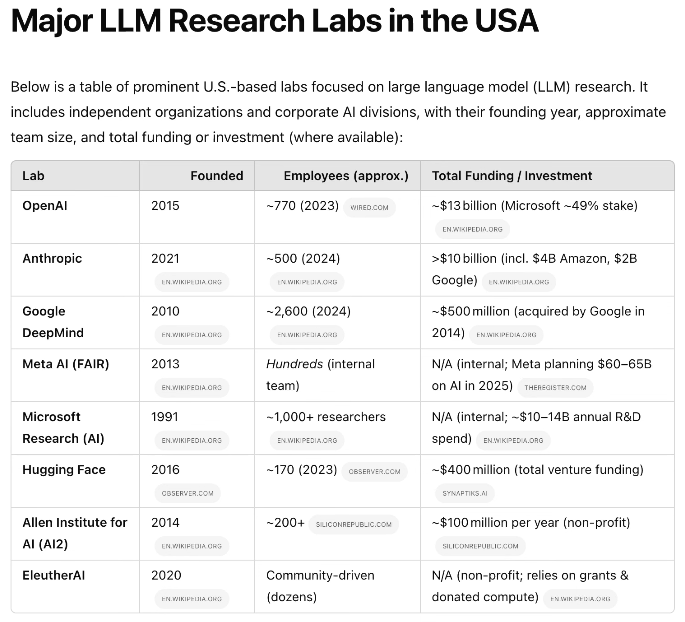
</center>

虽然这是一个旨在展示美国主要大语言模型研究实验室的综合表格，但 xAI 缺失了，Hugging Face 被列出，尽管严格来说它不是大语言模型研究实验室（他们更多地提供机器学习平台和开源工作生态系统），EleutherAI 也被列出，尽管它是一个去中心化的研究集体，而不是严格意义上的主要实验室。

### 文件上传

我们不仅可以让大语言模型在网上查找信息来整合特定信息，还可以通过上传文件让其分词并注入上下文窗口。

例如，Anthropic 的 Claude 支持文件上传，Google 的 NotebookLM 也是如此。
请注意，使用当前的分词技术，文档中的图像很可能被丢弃或仅被简要描述。

以下是将研究论文的 PDF 分别上传到 Claude 3.7 和 GPT 4o 的样子：

<center>
    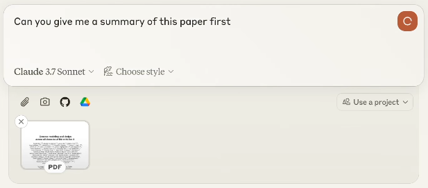
    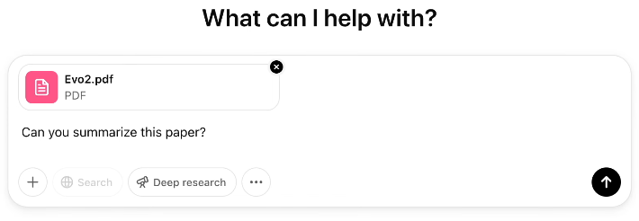
</center>

ChatGPT 随后会通过构建关于论文内容的报告来回应：

<center>
    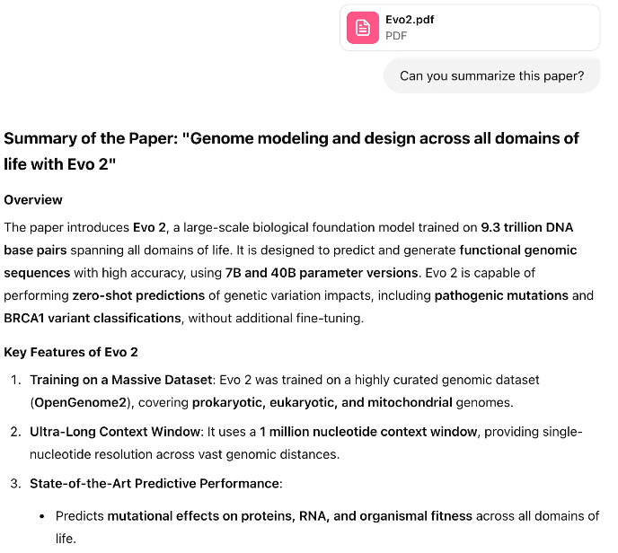
</center>

这也可以应用于书籍。<br>
例如，你可以将一本书的章节上传到 ChatGPT，阅读它并与模型对话。使用 Claude，你可以这样做：

<center>
    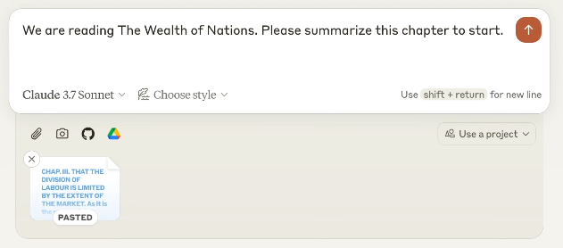
</center>

这会产生以下摘要：

<center>
    
</center>

有了这些，你就可以开始阅读实际的章节了，因为你已经知道要注意什么。

> [!NOTE]
> 具有文件上传功能或只是大上下文窗口的大语言模型可以让阅读更高效、更易获取和更容易记住。尝试不同的大语言模型以找到最适合你需求的是一个好主意。

### 程序执行

一些大语言模型甚至可以生成代码来解决复杂的编程或计算问题，请求在沙箱环境中执行此代码，然后将结果纳入其回复生成中。

<center>
    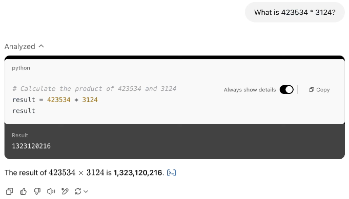
</center>

大语言模型实际上会暂停执行，直到程序结果可用，然后继续整合结果。请注意，并非所有支持工具使用的大语言模型也支持程序执行。目前，ChatGPT 和 Claude 支持程序执行。

尽管 xAI 声明 Grok 3 确实支持程序执行作为工具，但截至 2025 年 3 月，Grok 3 似乎没有对我们的示例应用任何程序执行，导致计算出错：

<center>
    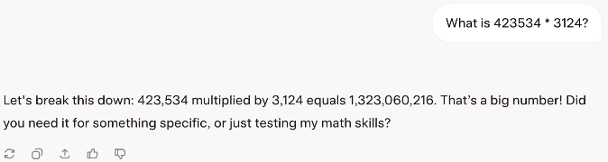
</center>

ChatGPT 使用编程语言 Python 来解决计算，而 Claude 则使用 JavaScript：

<center>
    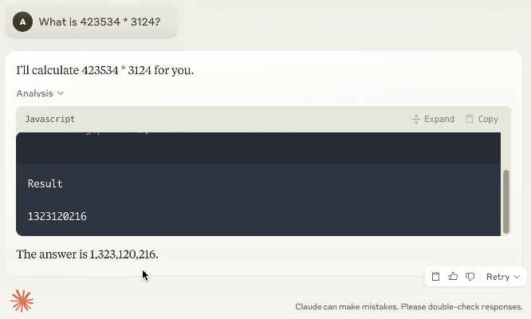
</center>

> [!NOTE]
> 不同的大语言模型有不同的可用工具，你需要在某种程度上跟踪哪个大语言模型支持哪个工具。

## 工具使用的实际应用

### ChatGPT 高级数据分析

通过工具使用，ChatGPT 提供了数据分析功能：

<center>
    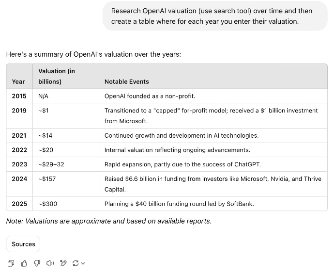
</center>

通过后续提示，检索到的信息可用于生成数据的可视化表示：

<center>
    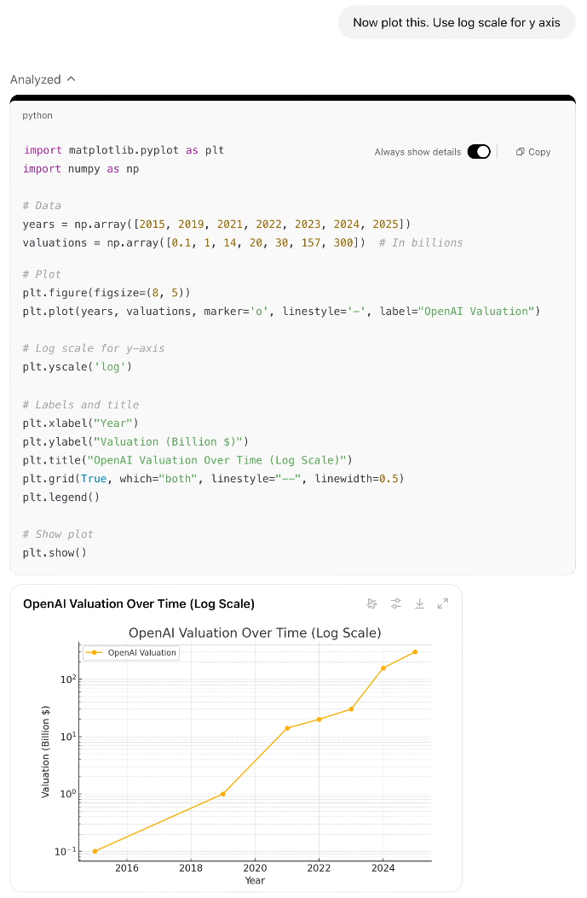
</center>

这很有帮助，就像初级数据分析师会产生这种分析一样。请注意 ChatGPT 仍然幻觉了部分回复。在表格显示 OpenAI 2015 年估值为 N/A 的地方，代码只是将 2015 年设置为 $0.1 百万美元。**始终阅读代码。如果你无法验证它，就不要使用它。**

不过，让我们继续使用数据分析功能进一步推断到 2030 年的预测：

<center>
    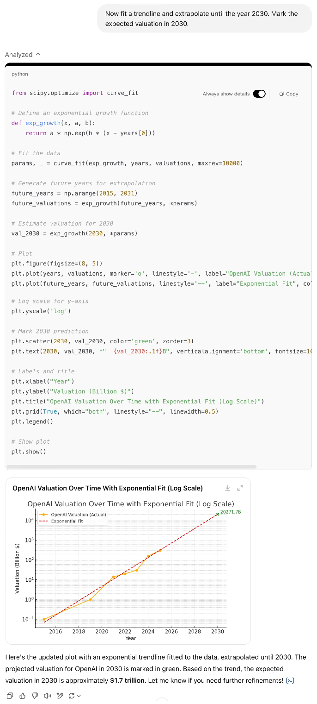
</center>

请注意，2030 年的书面估值为 1.7 万亿美元，而图表显示 20.27 万亿美元。同一预测的两个不同值。当要求 ChatGPT 提供实际变量值时，它会回复 20271.691539，即 20.27 万亿美元。

我们看到了工具使用的力量，它同样展示了幻觉和解释错误的陷阱。**始终始终验证你从大语言模型获得的信息。**充其量，此功能与初级数据分析师相当。

### Claude Artifacts

大语言模型一个非常强大的用例是为文档或书籍创建闪卡。完成后，可以进一步要求 Claude 应用 Artifacts 功能来创建一个实际的应用程序来学习这些特定的闪卡。此外，**Claude 构想的应用程序将直接在浏览器中、在 Claude 的界面内运行。**

<center>
    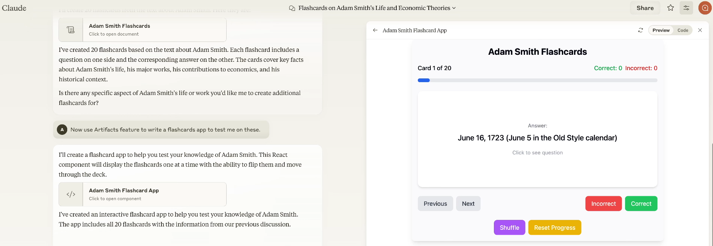
</center>

我们不是编写适应应用程序的闪卡，而是编写适应我们闪卡的应用程序。<br>
在[这里](https://claudeartifacts.com/)查看更多用户提交的 Claude Artifacts。

除了闪卡，Artifacts 的一个非常好的用例是基于内容的图表或思维导图生成。Claude 可以浏览文本，找到关键点、概念等，并将它们可视化组织起来，使文本更易于访问和理解。

### Cursor Composer

到目前为止，我们已经看到了很多大语言模型交互，全部在基于聊天的界面中并通过浏览器。大语言模型对编码非常有帮助，但在集成开发环境 (IDE) 和浏览器之间来回切换很快就会变得繁琐。

除了通过浏览器依赖大语言模型的功能外，专门的应用程序已经出现，例如：

- [Cursor](https://cursor.com/)
- [Windsurf](https://codeium.com/windsurf)
- [Trae](https://www.trae.ai/)
- [Fine](https://www.fine.dev/)
- [VS Code with Copilot](https://code.visualstudio.com/docs/copilot/overview)

这些应用程序直接与你计算机上的多个文件一起工作，以构建或维护代码项目。

IDE 集成的 AI 工具使用与浏览器界面（如 Claude）相同的大语言模型，但它们的 IDE 集成实现了更无缝的工作流程。例如，Cursor 的 composer 功能允许 Claude 直接将代码写入文件，实时构建功能性代码库，这是一种令人印象深刻但可能对开发者构成存在挑战的体验。

当然，你也可以从 Cursor 内部查询 Claude 关于代码库的特定部分，以获得解释、建议或改进。

> [!NOTE]
> 氛围编程 (Vibe coding) 是指将控制权交给大语言模型来为你编写代码。你提供想法，大语言模型做繁重的工作。而且，理想情况下，结果是可行的。

在最坏的情况下，像 Cursor 这样的应用程序仍然是非常好的 IDE，你可以自己工作和修复代码。**将大语言模型视为热心的初级开发者是合适的。你仍然需要监督。**

<center>
    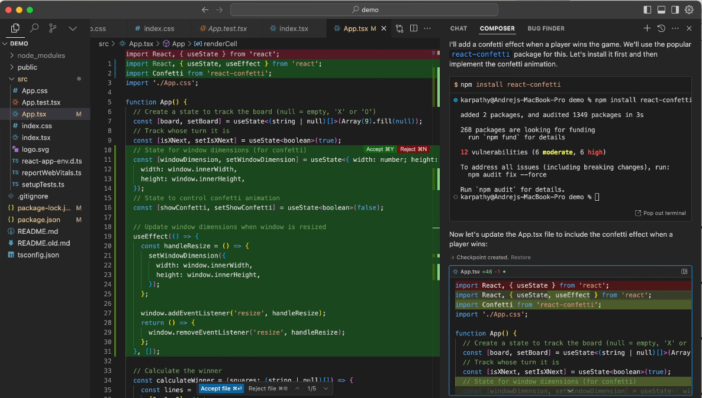
</center>

## 音频

在到目前为止的每一个实例中，与大语言模型的交互都是基于文本的。然而，许多大语言模型是多模态的，这意味着它们可以处理和生成文本、图像、视频和音频。

你实际上可以对大语言模型说话，它会以声音回应。<br>
ChatGPT 的移动应用程序就是一个很好的例子。

<center>
    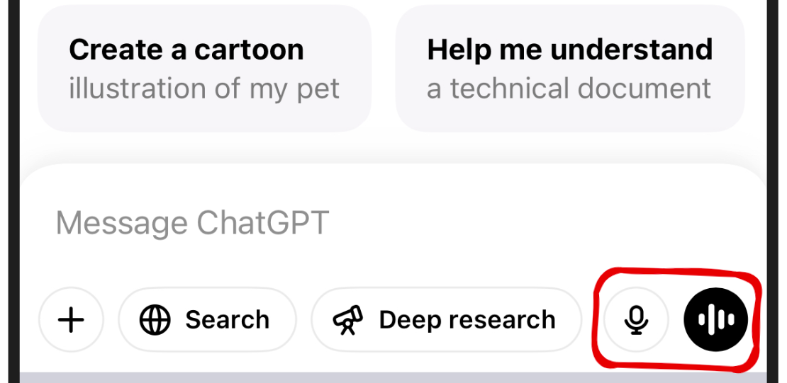
</center>

麦克风按钮允许语音转文本输入。<br>
不过这只能在应用程序中使用。如果你想在桌面上使用音频输入，你可以使用第三方应用程序如 [MacWhisper](https://goodsnooze.gumroad.com/l/macwhisper) 或 [SuperWhisper](https://superwhisper.com/) 来弥补差距。

下载并安装应用程序，对着应用程序说话，让应用程序将文本转录到 ChatGPT 的输入字段中，ChatGPT 生成的文本可以被朗读给你。

> [!NOTE]
> 尽可能使用语音。它*快*得多。

ChatGPT 的移动和桌面应用程序具有音频波形按钮，可启用语音模式。这将你的语音转换为大语言模型的 token，然后生成一个回复朗读给你。

> [!NOTE]
> ChatGPT 可以通过将音频频谱映射到 token 来真正原生地处理音频输入，并通过文本转语音处理音频输出。这是一个非常强大的功能，因为它允许与大语言模型进行更自然的交互。而且，高级语音模式对 ChatGPT 免费层级用户也可用。请注意，Grok 也提供真正的语音模式，但这仅限于应用程序。

### 播客生成

我们已经简要讨论过 [Google 的 NotebookLM](https://notebooklm.google.com) 及其接收多个文件供你与大语言模型对话的能力。NotebookLM 还有一个功能，可以根据你提供的文档生成定制的、按需的播客。

<center>
    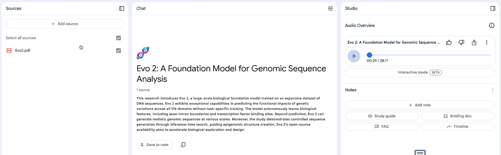
</center>

Andrej 实际上使用这个工具创建了 [Histories of Mysteries](https://open.spotify.com/show/3K4LRyMCP44kBbiOziwJjb) 播客系列。

## 图像

就像我们处理音频一样，大语言模型也可以通过将图像转换为 token 序列来处理图像。

> [!NOTE]
> 添加图像供大语言模型解释时，一个好做法是**让模型将图像内容描述回给你，以确保图像被正确读入和解释。**只有这样你才应该继续提问。

我们也可以用大语言模型生成图像，尽管这更多是通过工具使用来完成的，例如 OpenAI 的 ChatGPT 调用图像生成模型 [OpenAI DALL-E](https://openai.com/index/dall-e-3)。

## 视频

视频处理与 ChatGPT 的高级语音模式在智能手机上协同工作。该应用程序将摄像头画面和语音输入发送到 ChatGPT，ChatGPT 对视频输入进行分词，使大语言模型能够描述视频帧中看到的内容。此功能对视障用户等特别有价值。

<center>
    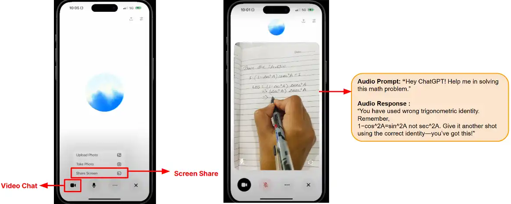
</center>

来源：["ChatGPT Can Now See You!" by K.C. Sabreena Basheer](https://www.analyticsvidhya.com/blog/2024/12/chatgpt-can-now-see-you/)<br><br>

视频输出表现不佳，但通过 OpenAI 的 Sora 等代理模型是可能的。你可以通过[这条推文/帖子](https://x.com/HBCoop_/status/1885002792017838233)查看最近视频模型的比较。

## 提升使用体验的功能

ChatGPT 提供了一些额外功能以进一步增强用户体验和易用性。

**记忆：**我们之前说过，一旦我们开始新的聊天，上下文窗口就会被清除。ChatGPT 现在提供了一个功能，可以跨聊天在*记忆库*中保存上下文窗口的摘要，这样你就可以跨会话继续使用信息。*记忆库*被添加到每个新聊天的上下文窗口前面。你也可以编辑和删除单个记忆。

**自定义指令：**你可以定义一个引导指令，为每个新聊天提供给 ChatGPT。这可以是提示词的风格、一组规则或你希望 ChatGPT 参考的特定上下文。

自定义指令的一个例子是：

```
- Be based, i.e. be straight-forward with me and just get to the point
- I am allergic to language that sounds too formal and corporate, like something that you would hear if you are talking to your HR business partner. Avoid this type of language.
- I love learning, explanations, education, and insights. When you have any opportunity to be educational, or to provide an interesting insight or a connection or an analogy, please take it.
```

**自定义 GPT：**ChatGPT 独有的功能，允许用户创建具有定义的人格、技能、知识库和任务解释的专门 AI 版本。这对语言学习或翻译等场景很有用，因为它消除了在每个提示词中指定任务的需要：

<center>
    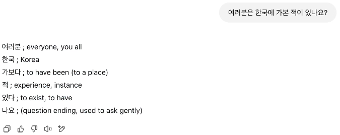
</center>

你可以用*全局指令集*来引导整个 GPT，例如像这样，以 few-shot 提示词风格：

<center>
    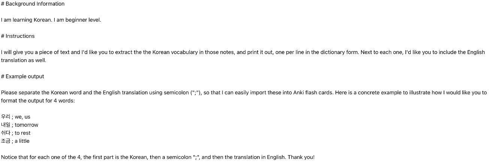
</center>

这也可以扩展到其他 ChatGPT 工具和功能，如图像处理：

<center>
    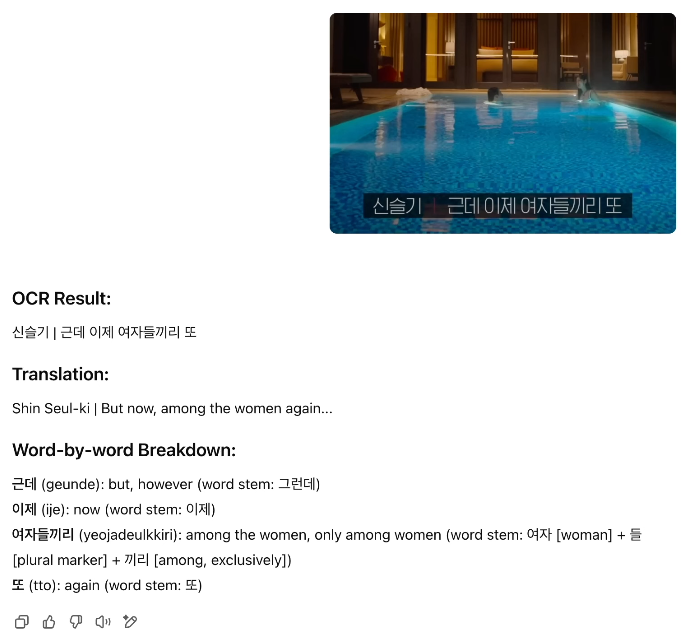
</center>

## 总结

总之，我们看到了一个不断发展、不断增长的日益强大的大语言模型生态系统，它们可能仍有其缺点，但完全能够在广泛的任务中提供有价值的帮助，例如通过工具使用、推理和多模态。

<center>
    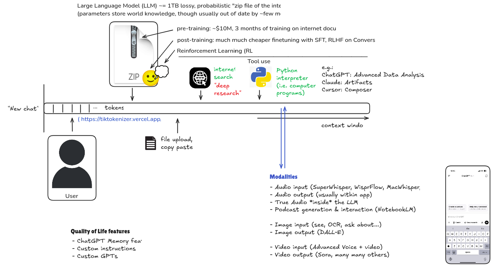
</center>

在任何时候，你基本上都是在与某个知识的"有损 .zip 文件"对话，这个"文件"通过几个阶段被暴露于该知识，旨在几个不同的目的。注意模型层级和模型能力。推理是复杂任务的发展方向，但计算成本更高。尽可能使用工具，特别是对于小众的、最近的但可找到的信息。而且**始终验证你从大语言模型获取的信息**。
