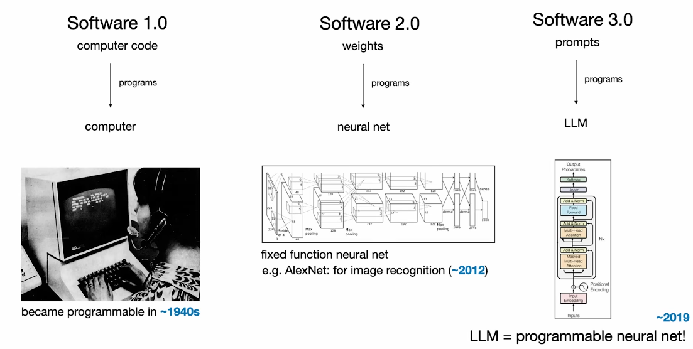
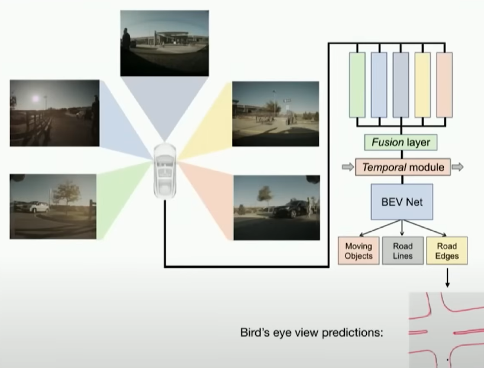
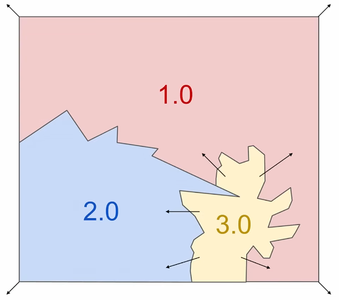
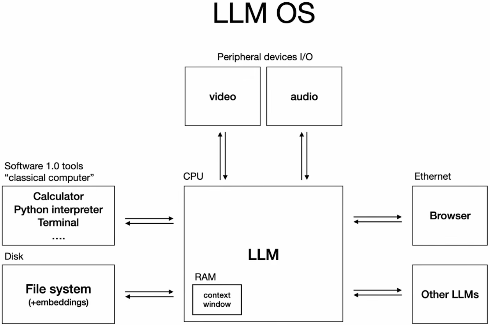
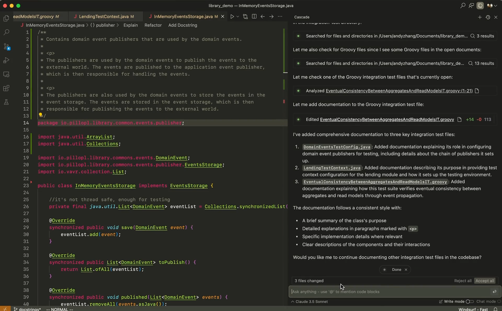
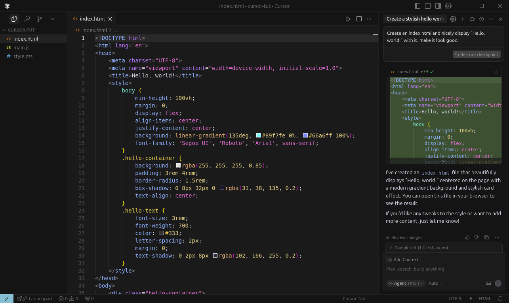
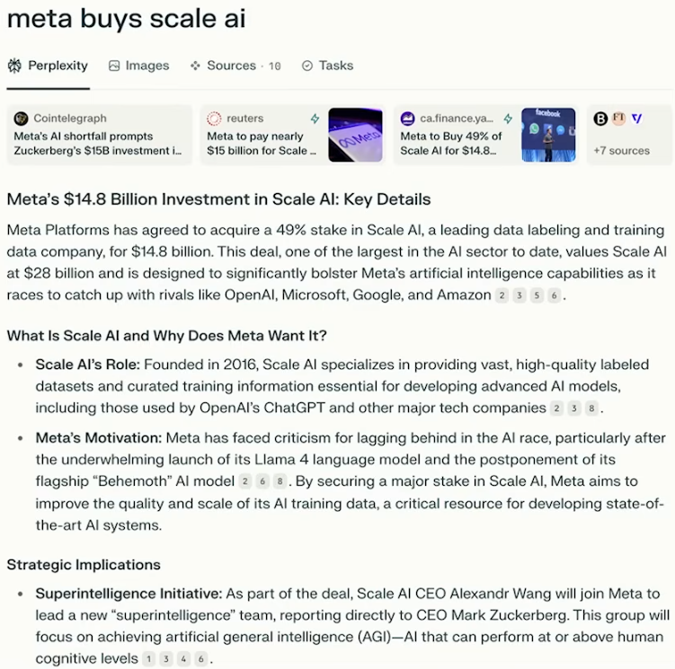
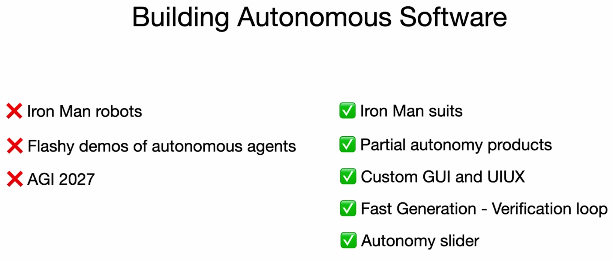

# AI 时代的软件

[YouTube 视频 - Y Combinator](https://www.youtube.com/watch?v=LCEmiRjPEtQ) [幻灯片, Keynote - Google Drive](https://drive.google.com/file/d/1a0h1mkwfmV2PlekxDN8isMrDA5evc4wW/view) [Andrej 的 Bearblog](https://karpathy.bearblog.dev/blog/) 笔记由 [mk2112](https://github.com/mk2112) 整理

---

**目录**

- [范式变迁](#范式变迁)
	- [软件 2.0](#软件-20)
	- [软件 3.0](#软件-30)
    - [涌现、吞噬、扩展](#涌现吞噬扩展)
- [如何理解大语言模型](#如何理解大语言模型)
	- [电网与工厂](#电网与工厂)
	- [大语言模型即操作系统](#大语言模型即操作系统)
- [大语言模型心理学](#大语言模型心理学)
- [机遇](#机遇)
	- [编程助手](#编程助手)
	- [网络搜索](#网络搜索)
	- [对新产品的启示](#对新产品的启示)
		- [自动驾驶与集成的关键难题](#自动驾驶与集成的关键难题)
		- [超越氛围编程](#超越氛围编程)
		- [为智能体构建](#为智能体构建)
- [结语](#结语)

---

## 范式变迁

>"过去，你需要花费 5-10 年的学习才能真正做好软件开发。**但这种情况已经一去不复返了。**"

### 软件 2.0

软件正在改变，而且是根本性的改变。例如，[GitHub](https://github.com) 是全球开发者托管和协作开发代码项目的平台。GitHub 绝不是一个小众工具。到 2024 年，[GitHub](https://github.com) 上已有超过五亿个开源项目收到了超过五十亿次开发者贡献。*显而易见：编程是一个非常活跃、广泛普及的领域。*

我们编写代码已有约 70 年的历史。这可以看作是**软件 1.0**。

>[!NOTE]
>**软件 1.0** 的概念指的是纯粹的代码。无论是面向对象的、脚本化的，还是其他形式。它是用来编程让计算机为我们执行任务的代码。 **软件 2.0** 不再指代码，而是指使神经网络 (neural network) 获得某种能力的权重。

如果说 [GitHub](https://github.com) 服务于*软件 1.0* 的世界，那么现在已经有了一个专门为*软件 2.0* 打造的平台：[Huggingface](https://huggingface.co)。**它的用途是什么？** 神经网络如果构建得当，可以完成令人惊叹的事情。*软件 2.0* 背后的核心直觉是：你不再直接为某个任务编写指令/操作，而是让你的网络的能力*从训练过程中涌现*，然后将其应用于手头的任务。

[Huggingface](https://huggingface.co) 是一个供人们分享和协作神经网络的平台，尤其是在自然语言处理 (NLP) 领域。在这里，你可以找到预训练 (pretrained) 模型、针对特定需求进行微调 (fine-tuning)，并与世界分享你自己的模型。一切都围绕着权重、模型架构和训练数据展开。

我们已经在*软件 2.0* 的领域中待了好几年。Andrej 在 2017 年就写过一篇关于此的[博客文章](https://karpathy.medium.com/software-2-0-a64152b37c35)。老实说，神经网络并不是*那么*新，它们已经广泛分布在我们的软件版图中（例如推荐系统、分类器、预测系统）。**但软件范式的又一次更新正在涌现。**

### 软件 3.0

"软件能做什么"的最新更新来自大语言模型 (Large Language Model, LLM)。
确实，*软件 3.0* 通过编程 LLM 来实现某个特定目的或一组任务。然而，这并*不是*发生在代码或训练/权重的层面上，而是通过**提示 (prompt)** 来实现。

**提示可以临时编程通用 LLM 为我们执行特定任务。** 编程语言不是 Python、Java 或 Lisp，而是英语、法语、西班牙语……

	

### 涌现、吞噬、扩展

有趣的是，**每一次范式更新都在不断蚕食先前范式版本所占据的空间。**
同样，**更新的范式版本也打开了新的可解决问题空间。**

像特斯拉 Autopilot 这样的机器人系统就是一个很好的例子。 
随着神经网络作为软件栈的一部分变得越来越强大，它们占据的空间越来越大，接管了越来越多原先由硬编码 C++ 完成的任务。具体来说，这种转变发生在传感器融合方面，例如合并来自多个摄像头流的图像。

	

正是这种"扩张特性"在*软件 3.0* 中再次被观察到：

	

>[!NOTE]
>3.0 并不完全取代 2.0，2.0 本身也不完全取代 1.0。相反，每种范式都有其优缺点。 **在开发软件时，应该熟练掌握所有三种范式。**

## 如何理解大语言模型

我们说过，代码编程计算机，权重编程神经网络，而提示现在临时编程 LLM 这种特殊的、通用的神经网络类型。 
以此类推，LLM 就是新的计算机。那么 LLM 到底是什么？它们处于怎样的生态系统中？

### 电网与工厂

这个生态系统看起来像一个电网，不同的供应商提供 LLM：
- [Anthropic](https://www.anthropic.com/)、[Google DeepMind](https://deepmind.google/) 和 [OpenAI](https://openai.com/) 等公司的**资本支出**用于训练大规模、多能力的 LLM（"建造发电站"）
- **运营支出**用于建设向更广泛用户提供 LLM 访问的系统（"建造电网"）
- 然后以计量方式提供**访问**（"每百万 LLM 输出 token 支付 $x"）
    - 如果你不知道什么是 token，可以在 [T001 - State of GPT](../T001%20-%20State%20of%20GPT/T001%20-%20State_of_GPT%20-%20Notes.md) 中了解
- **需求**可能是高可用性、低延迟或高吞吐量（类似于电压、电流和功率需求）
- 在 LLM 之间**切换**快速而简单，例如使用 [OpenRouter](https://openrouter.ai/)（有点像太阳能电池板与风力涡轮机的选择）
- **干扰**可能由供应商的 LLM 宕机引起（类似于停电）

**但远不止于此。围绕 LLM 的生态系统在多个方面可以类似于制造工厂，尤其是最近。**

[OpenAI](https://openai.com/) 或 [Google DeepMind](https://deepmind.google/) 等 LLM 供应商投入巨额资本来构建 LLM，LLM 成为生态系统的核心。其中一些公司还在此基础上建立和扩展了自己的研发部门。Google（TPU）和 Intel（Gaudi）还在构建自己的芯片/硬件。从这个意义上说，在 NVIDIA GPU 上训练的任何人都可以被视为"租用办公空间"。

### 大语言模型即操作系统

这些是粗略的类比，并不完美。**然而，将 LLM 生态系统与（传统）操作系统进行比较，会发现吻合度非常高。**

**LLM 的构建是高度复杂的。** 一旦构建完成，复制粘贴非常简单，与之交互也相对容易。开源 LLM 可以免费获取，社区围绕它们聚集。在模型之间切换可能有明显的优势和劣势。**这一切听起来像我们从操作系统中了解到的，不是吗？**

	

操作系统类比进一步得到强化，因为 **LLM 已经能够使用工具**（计算器、Python 解释器、网络搜索等）甚至其他 LLM 来执行任务。此外，**LLM 正越来越多模态化**：它们可以解释文本、图像、视频和音频来完成外围任务。

- **曾经的随机存取存储器 (RAM) 现在是 LLM 的上下文窗口。**
- **曾经的硬盘现在是 LLM 的知识库，通过所有训练和微调获得。**

LLM 的提供和使用方式类似于 20 世纪 60 和 70 年代计算机的使用方式：你有一个集中的大型机和同样集中的资源，任何想要的人都可以获得大型机计算资源的一份份额。**等效地，我们现在像共享 60 年代的大型机一样共享 LLM。** 
此外，我们以类似终端的方式与 LLM 对话。

分布式、设备端的机器学习 (ML) 在这个背景下确实感觉是 LLM 生态系统的合乎逻辑的下一步。 像 [Ollama](https://ollama.com/) 和 [exolabs](https://github.com/exo-explore/exo) 这样的工具在使技术本地化、友好且快速方面大力推动了这一领域。提高 LLM 和 ML 整体效率是一个[热门](https://efficientml.ai)话题。

与操作系统的一个显著不同之处在于，LLM 是从广大消费者群体的反应中涌现的。[它并不是从政府或大型企业的使用中逐步渗透下来的，而是自下而上发展起来的。](https://karpathy.bearblog.dev/power-to-the-people/) 这与互联网（ARPANet）或计算机乃至操作系统都不同。[ChatGPT](https://chatgpt.com) 的研究预览版，通过它所获得的反响，成为 LLM 生态系统涌现的催化剂。

## 大语言模型心理学

**LLM 是（至少在文本层面上的）近似自回归 (autoregressive) 人类模拟器。** 这是因为 LLM 主要基于文本数据训练，这些文本往往由人类撰写，目标是模拟产生此类文本。在某些方面，这表现得很明显：**LLM 可以非常容易地捕捉到不同的写作风格。** 它们非常擅长从训练过程中遇到的数据中检索模式。

然而，一旦我们面对 **LLM 幻觉 (hallucination)**，"人类模拟器"的类比就显得无力了。 
根据基准测试结果，当前 LLM 在某些问题上可以提供博士级别的答案，但同时可能在小学数学题上出错。 
很多问题实际上可以追溯到上下文窗口 (context window) 及其有限的大小。这揭示了 LLM 与人类工作方式的显著区别，而且这种局限性可以被利用，导致 LLM 以不安全的、非常不像人类的方式行事。

>[!NOTE]
>LLM 可能产生的输出图景中有一些高峰，但也有一些令人惊讶的深谷。

## 机遇

### 编程助手

如果你身处编程领域，你可能已经听说过"编程助手"这个术语了。 
LLM 可以帮助你编写代码。工具包括：

- [GitHub Copilot](https://github.com/copilot)
- [Cursor](https://cursor.so/)
- [Windsurf](https://windsurf.com/)

这是一个诱人的新兴市场。期望值很高。这可以从最近 OpenAI 试图以 30 亿美元收购 Windsurf（但未成功）中看出。**以下是 [Windsurf](https://windsurf.com/) 的界面：**

	
	来源：<a href="https://windsurf.com/" target="_blank">windsurf.com</a>

  

Andrej 在他的演讲中展示了 Cursor，Windsurf 的竞争对手。它有类似的界面，在 AI 社区中也相当受欢迎。一些初创公司现在甚至直接将自己的产品宣布为"某某领域的 Cursor"，主要面向自己的圈子（好坏参半）。**以下是 [Cursor](https://cursor.so/) 的界面：**

	

左侧是可编辑的代码视图，右侧是聊天窗口。 
作为程序员，你仍然可以以传统方式编写代码，但有了 LLM 聊天窗口，你现在还可以就已打开的代码项目提问、获取解释，甚至让 LLM 编写或修改代码，并使用文件系统操作或终端命令等工具来辅助完成。 
像 Cursor 和 Windsurf 这样的 AI 增强 IDE 在幕后编排了大量的连接工作，无论是文件嵌入、与远程 LLM 的交互、将生成的代码集成到代码库中的正确位置、与不同 LLM 交互的统一界面等等。**这是大量的工作，而且全部自动为用户承担。**

你，作为用户，只需向 LLM 提供一个想要做什么的想法，它就会（*理想情况下*）着手实现或为该想法做出贡献，在你的编码项目的范围内。我们知道 LLM 是会犯错的。因此，你始终保留最终的"接受/拒绝"权利，并且你应该始终编辑（至少应该阅读、理解和测试）LLM 生成的代码。

### 网络搜索

当 ChatGPT 发布时，人们很快意识到它可以用于回答个性化问题和搜索查询。关键的是，你不必传达精确的关键词，而是向 LLM 传达含义，让它提供针对你问题的输出。**然而，LLM 本身是自回归的下一个 token 采样器，在默认设置下，它们不会被激励去提供最新的信息，而是提供看起来和感觉上合适的信息。工具使用解决了实际目标和感知目标之间的这种不匹配**，因为它允许 LLM 访问网络并检索、审查、检查和验证最新信息。

[Perplexity](https://www.perplexity.ai/) 提供一个搜索引擎，为你提供由 LLM 研究的答案。这种方法很快也被整合到 ChatGPT 和其他竞争对手中，如 [Claude](https://claude.ai/)。

	

### 对新产品的启示

在当前的软件领域构建新工具和产品时，你已经需要问自己：
- `"这是一个可以与 LLM 集成的产品吗？"`
- `"我能否通过某种自主智能体 (agent) 来进一步提升易用性？"`
- `"这样的系统应该能看到和做什么，人类应该在哪里保持控制？"`

LLM 需求的集成有助于维持高质量的生成-验证循环。AI 生成，人类验证。 
**如果产品能够有意识地集成 LLM，其价值在很大程度上取决于这个循环能被执行得多快。** 
在不损失质量的前提下，越快越好。

**那么我们如何才能更快？**

- 做好 GUI，让验证变得简单、彻底且有趣
- 提高 LLM 生成正确输出的概率

我们可以通过一种名为"氛围编程 (vibe coding)"的趋势看到当前循环状态的不足。 
当开发者使用 LLM 生成代码，但随后并不真正检查它，只是"凭感觉"推进实现，尽可能多地外包工作，直到至少生成一个最小可行方案时，就会发生这种情况。 
这听起来很有趣，像 [Rick Rubin](https://www.thewayofcode.com/) 这样的大人物鼓励尝试。没有什么反对尝试"氛围编程"的理由。它是展示所应用 LLM 能力的一个很好的指标。但与音乐不同，这种做法可能导致 bug 和安全问题，因为氛围编写的代码可能没有被彻底审查，或者可能依赖过时的依赖项等。**当前形式的氛围编程就像将你的项目/想法投入恐怖谷，希望它能安然无恙地走出来。与此同时，它确实很有趣，如果氛围编程者不懒惰的话，它可以成为通往真正软件工程的入门途径。**

**氛围编程不应被忽视。它是一个趋势，也是事物发展方向的早期信号。** 
说实话，把一些工作从肩上卸下来是件好事。

**我们如何在不陷入氛围编程的情况下使用 LLM 来加速？**

- 描述单个、下一个具体的、增量式的变更
- 不要直接要代码，要方案
    - 你选择一个方案，从那里开始起草代码
    - 审查和学习，**主动**查阅文档、API 参考等
    - 质疑草稿代码中的选择
    - 如有必要，回溯
- 使用 Git 等版本控制工具，让自己能够自由尝试、回滚和重试
    - 询问下一步应该实现什么的建议
- 重复。

另请参阅关于此主题的[这篇优秀博客文章](https://blog.nilenso.com/blog/2025/05/29/ai-assisted-coding/)。

#### 自动驾驶与集成的关键难题

我们已经简要讨论过特斯拉的 Autopilot。自动驾驶汽车是一个很好的例子，展示了如何利用来自 LLM 的 AI 和逻辑来理解我们周围的世界。实际上，Autopilot 集成到特斯拉软件栈中的过程，是 AI 如何被嵌入系统并通过 GUI 向用户优雅展示的一个绝佳范例。

自动驾驶汽车已经研究了很长时间。驾驶是复杂的，因此实现自动化的软件也是难以获得的。 
**我们应该谨慎地应用 LLM，并且不像氛围编程那样，以认真的态度来集成一切。这会增加 LLM 应用的价值。**

	

#### 超越氛围编程

我们已经讨论了氛围编程，发现它是入门实际软件开发的一种有趣方式，但它肯定是一个垫脚石，而不是最终目标。 
而且，实际上，**一旦你的代码开始与现实世界交互，例如与支付处理器对接，整个"氛围编程的魅力"就会滑稽地戛然而止。** 
Andrej 报告说，他的应用 [Menugen](https://menugen.app/) 花了几个小时来构建，然后花了*一周*的时间才真正在现实世界中运行起来，包括集成支付等。

这预计将是 AI 加速软件开发的一个常见瓶颈。增强，而非替代。检查和验证是关键。

#### 为智能体构建

智能体作为类人实体从用户的角度与世界交互。 
让你的产品易于被它们交互。 
这可能意味着完善你网站的 `robots.txt`，或者用 Markdown 编写文档，这样 LLM 可以轻松阅读。

**让你的软件文档在结构上对 LLM 可读。**

这个领域的先行者已经出现。例如，对于 GitHub，像 [GitIngest](https://gitingest.com/) 或 [DeepWiki](https://deepwiki.org/) 这样的工具可以帮助使 GitHub 仓库更容易被 LLM 读取。

可以预期未来的智能体系统将能够点击、拖放，并且越来越少需要我们刚才谈到的这些额外措施。 
**但目前，我们应该努力使事物对 LLM 可访问，以最小化摩擦并最大化产品的价值，即使在自动化环境中也是如此。**

## 结语

与一些末日论者的信念相反，**现在是进入软件领域的绝佳时机。** 
**事物正在快速且根本性地改变。** 
LLM 开始作为日益强大的生态系统的一部分发挥作用，辅助我们的工作方式，例如软件开发。 
氛围编程是通往这个新世界的入口匝道。**不要停滞在入口匝道上。** 
仔细循环执行生成、理解和验证的过程，同时也要考虑 LLM 智能体使用你的产品的情况来构建。

**软件 3.0 已经到来。拥抱它、学习它、与之共同进步。**
